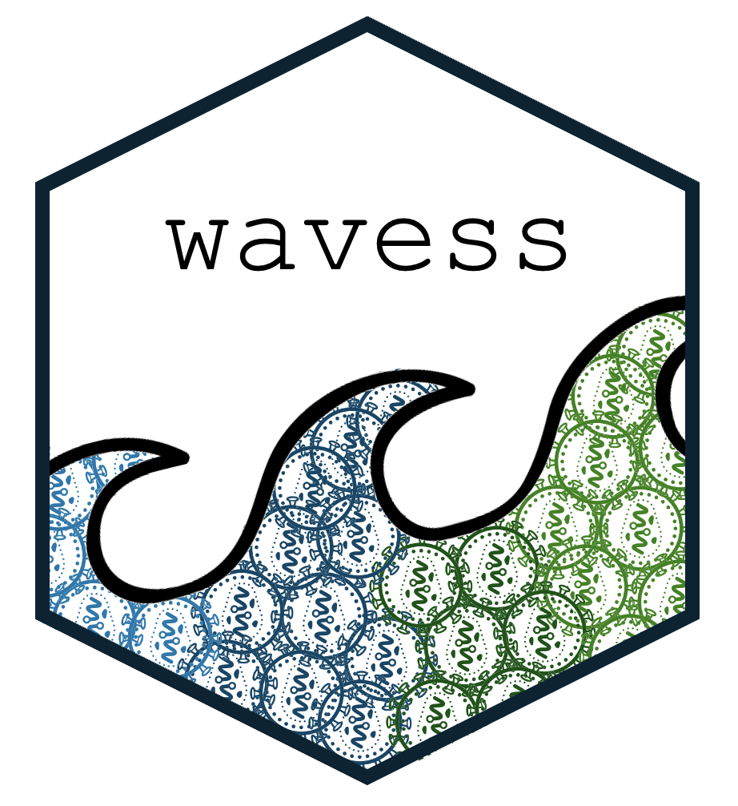

<!-- README.md is generated from README.Rmd. Please edit that file -->

```{r, include = FALSE}
knitr::opts_chunk$set(
  collapse = TRUE,
  comment = "#>",
  fig.path = "man/figures/README-",
  out.width = "100%"
)
```

# wavess

**Within-host adaptive virus evolution sequence simulator.**

<!-- <a href='https://github.com/MolEvolEpid/wavess/'></a> -->


<!-- badges: start -->
[](https://github.com/MolEvolEpid/wavess/actions/workflows/R-CMD-check.yaml)
[](https://app.codecov.io/gh/MolEvolEpid/wavess?branch=main)
<!-- badges: end -->

The goal of wavess is to simulate within-host virus sequence evolution
optionally including recombination, a latent infected cell reservoir,
and four types of selection (conserved sites, comparison to a fit
sequence, cytotoxic T-lymphocyte (CTL)-mediated immunity, and
antibody-mediated immunity). The package also provides functions to
pre-process data for input into the simulator, as well as
post-processing functions to analyze the simulation output. The
post-processing functions can also be used on empirical data. The
default settings for the simulator assume that the sequences being
simulated are HIV-1 gp120.

The core of the wavess algorithm is written in Python, with a wrapper
function in R. Therefore, wavess can be run in R or Python. All helper
functions related to preparing model inputs and analyzing model outputs
are contained solely in the R package.

Below, we briefly share information about the R package. For more
details about running `wavess`, including a tutorial, please visit our website:
[molevolepid.github.io/wavess/](https://molevolepid.github.io/wavess/).
For more details about the model, please check out the [original
paper](https://journals.plos.org/ploscompbiol/article?id=10.1371/journal.pcbi.1013437)
and the [paper describing the CTL
response](https://www.biorxiv.org/content/10.64898/2026.02.19.706869v2).


## Installation

You can install the development version of the `wavess` R package from
[GitHub](https://github.com/MolEvolEpid/wavess) with:

``` r
# install.packages("remotes")
remotes::install_github("MolEvolEpid/wavess")
```

This will not install the vignettes locally, but you can still see the
vignettes on the [website](https://molevolepid.github.io/wavess/). If
you’d like to install the vignettes locally, you can use the command:

``` r
# install.packages("remotes")
remotes::install_github("MolEvolEpid/wavess", build_vignettes = TRUE, force = TRUE)
```

## Tutorials (vignettes)

Tutorials (vignettes) providing a detailed step-by-step guide with examples 
of how to use the model and analyze the output are hosted on our
[website](https://molevolepid.github.io/wavess/) under the “Articles”
tab, or if you installed them locally you can check them out using the
`vignette()` command. Links to specific tutorials are also included below.

- [Preparing input
  data](https://molevolepid.github.io/wavess/articles/prepare_input_data.html)  
  The details about generating input data.  
  To render locally: `vignette("prepare_input_data")`
- [Running
  wavess](https://molevolepid.github.io/wavess/articles/run_wavess.html)  
  How to run the wavess algorithm.  
  To render locally: `vignette("run_wavess")`
- [Analyzing the
  output](https://molevolepid.github.io/wavess/articles/analyze_output.html)  
  Examples of how to analyze the output of wavess.  
  To render locally: `vignette("analyze_output")`
- [Running the python
  script](https://molevolepid.github.io/wavess/articles/python.html)  
  How to run wavess using a Python script.  
  To render locally: `vignette("python")`

## Citation

If you use the wavess algorithm or any of the helper functions, please
cite this paper:  
[wavess: An R package for simulation of adaptive
within-host virus sequence
evolution](https://journals.plos.org/ploscompbiol/article?id=10.1371/journal.pcbi.1013437)

If you model the CTL response or use the variable recombination rate
feature, please also cite:  
[wavess 1.2: Presenting an HLA-aware
within-host virus sequence simulation
framework](https://www.biorxiv.org/content/10.64898/2026.02.19.706869v2)

You can also see the citations using the following command in R:

``` r
citation("wavess")
```

## Contributing

You are of course welcome to fork the package for your own use. If you
would like for your changes to be incorporated into the latest version
of `wavess`, please open an
[issue](https://github.com/MolEvolEpid/wavess/issues) related to your
proposed change, create a [pull
request](https://github.com/MolEvolEpid/wavess/pulls) with the
implemented change, or reach out to <tkl@lanl.gov>,
<nsambaturu@binghamton.edu>, or <zenalapp@lanl.gov>.
