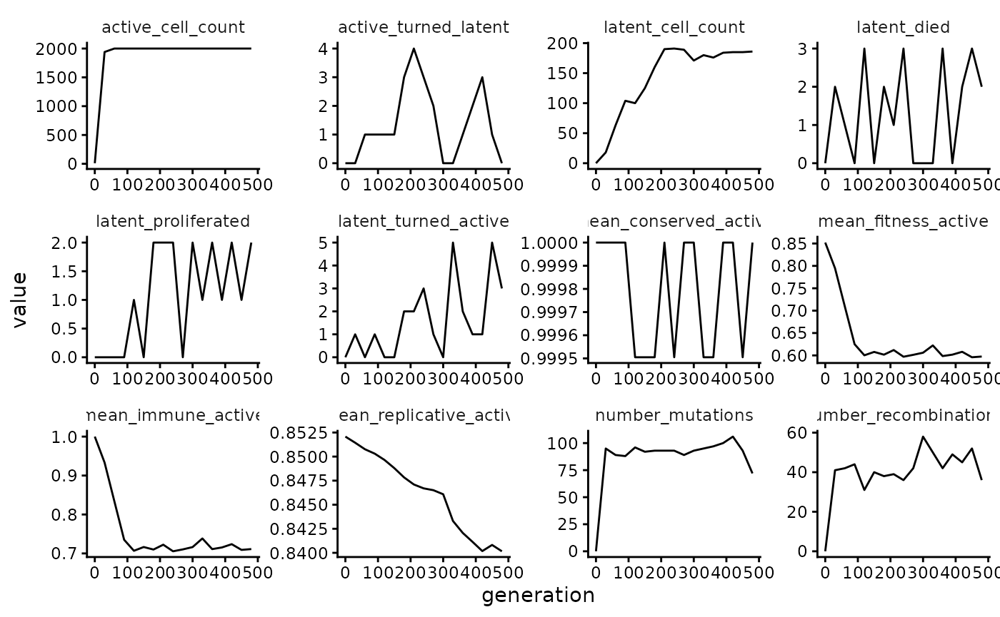
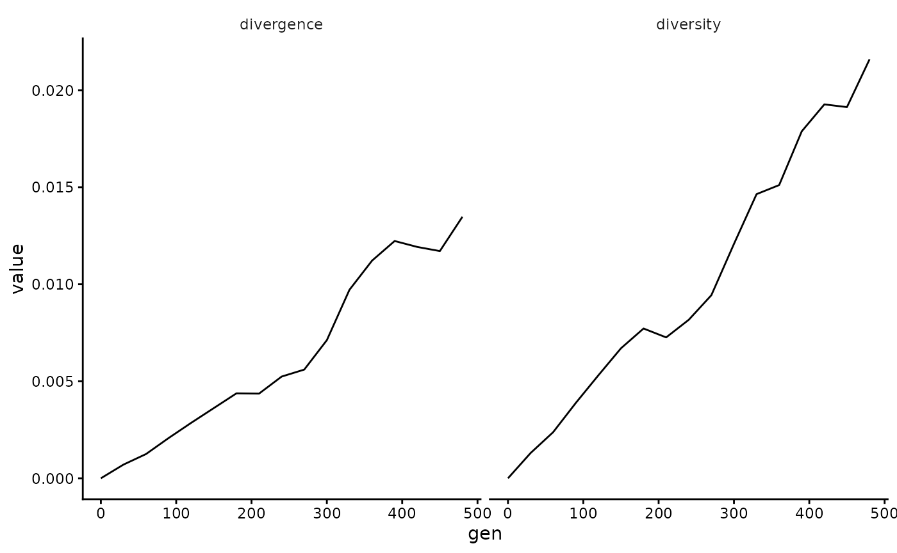
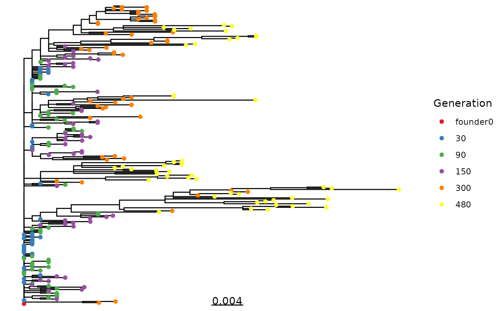

# Analyze wavess output

In this vignette, we’ll provide various ways to analyze the output of
[`run_wavess()`](https://molevolepid.github.io/wavess/reference/run_wavess.md).
Note that many of these functions can also be used to analyze real-world
empirical data.

For simulated data, we highly recommend comparing the output to
empirical data, or at least using your domain knowledge to determine
whether the output seems reasonable. If it doesn’t, you may have to
tweak various input parameters to get believable outputs. The default
input parameters we provide generally lead to a reasonable output for
HIV, but even so, due to the stochastic nature of the model, some
outputs look more like real data than others.

## Run wavess

First, let’s load the relevant libraries, set the default plotting
theme, and run wavess including all the selective pressures. We’re going
to set a seed for reproducibility. For more details on the input and
running wavess, please see the respective vignettes.
([`vignette("prepare_input_data")`](https://molevolepid.github.io/wavess/articles/prepare_input_data.md)
and
[`vignette("run_wavess")`](https://molevolepid.github.io/wavess/articles/run_wavess.md)).
If you haven’t checked out those vignettes first, be sure to at least
run the
[`create_python_venv()`](https://molevolepid.github.io/wavess/reference/create_python_venv.md)
function prior to running the below code, or else you’ll get an error
telling you to do so.

``` r

library(wavess)
library(dplyr)
#> 
#> Attaching package: 'dplyr'
#> The following objects are masked from 'package:stats':
#> 
#>     filter, lag
#> The following objects are masked from 'package:base':
#> 
#>     intersect, setdiff, setequal, union
library(ggplot2)
library(tidyr)
library(ape)
#> 
#> Attaching package: 'ape'
#> The following object is masked from 'package:dplyr':
#> 
#>     where
library(phangorn)
library(ggtree)
#> ggtree v4.2.0 Learn more at https://yulab-smu.top/contribution-tree-data/
#> 
#> Please cite:
#> 
#> Guangchuang Yu, David Smith, Huachen Zhu, Yi Guan, Tommy Tsan-Yuk Lam.
#> ggtree: an R package for visualization and annotation of phylogenetic
#> trees with their covariates and other associated data. Methods in
#> Ecology and Evolution. 2017, 8(1):28-36. doi:10.1111/2041-210X.12628
#> 
#> Attaching package: 'ggtree'
#> The following object is masked from 'package:ape':
#> 
#>     rotate
#> The following object is masked from 'package:tidyr':
#> 
#>     expand

set.seed(1234)

theme_set(theme_classic() +
  theme(strip.background = element_rect(color = "white")))

# if needed
create_python_venv()
#> Using Python: /usr/bin/python3.12
#> Creating virtual environment 'r-wavess' ...
#> + /usr/bin/python3.12 -m venv /home/runner/.virtualenvs/r-wavess
#> Done!
#> Installing packages: pip, wheel, setuptools
#> + /home/runner/.virtualenvs/r-wavess/bin/python -m pip install --upgrade pip wheel setuptools
#> Installing packages: numpy
#> + /home/runner/.virtualenvs/r-wavess/bin/python -m pip install --upgrade --no-user numpy
#> Virtual environment 'r-wavess' successfully created.
#> Using virtual environment 'r-wavess' ...
#> + /home/runner/.virtualenvs/r-wavess/bin/python -m pip install --upgrade --no-user scipy
#> Installation of scipy version 1.17.1 complete.
#> Using virtual environment 'r-wavess' ...
#> + /home/runner/.virtualenvs/r-wavess/bin/python -m pip install --upgrade --no-user pandas
#> Installation of pandas version 3.0.3 complete.
#> Warning in create_python_venv(): Skipped installation of the following
#> packages: numpy Use `force` to force installation or update.

pop <- define_growth_curve(n_gens = 500)
samp <- define_sampling_scheme(sampling_frequency_active = 30, max_samp_active = 50) |>
  filter(day <= 500)

founder_ref <- extract_seqs(hxb2_cons_founder,
  founder = "B.US.2011.DEMB11US006.KC473833",
  ref = "CON_B(1295)",
  start = 6225, end = 7787
)
gp120 <- slice_aln(hxb2_cons_founder, 6225, 7787)
epi_probs <- get_epitope_frequencies(env_features$Position)
ref_founder_map <- map_ref_founder(gp120,
  ref = "B.FR.83.HXB2_LAI_IIIB_BRU.K03455",
  founder = "B.US.2011.DEMB11US006.KC473833"
)
epitope_locations <- sample_epitopes(epi_probs,
  ref_founder_map = ref_founder_map
)
#> 12 resamples required

wavess_out <- run_wavess(
  inf_pop_size = pop,
  samp_scheme = samp,
  founder_seqs = rep(founder_ref$founder, 10),
  conserved_sites = founder_conserved_sites,
  ref_seq = founder_ref$ref,
  epitope_locations = epitope_locations,
  seed = 1234
)
#> Warning: `epitope_locations` is deprecated; please use `b_epitope_locations`
#> instead.
```

## Plotting counts

Here are various counts and mean fitness values plotted over time:

``` r

wavess_out$counts |>
  pivot_longer(!generation) |>
  ggplot(aes(x = generation, y = value)) +
  facet_wrap(~name, scales = "free") +
  geom_line()
```



## Diversity and divergence

Within-generation diversity and divergence from the founder sequence
across time can be computed and plotted as follows (reference for
calculations
[here](https://journals.plos.org/ploscompbiol/article?id=10.1371/journal.pcbi.1004625)):

``` r

gens <- gsub("gen|_.*", "", labels(wavess_out$seqs_active))
(div_metrics <- calc_div_metrics(wavess_out$seqs_active, "founder0", gens) |>
  filter(!is.na(diversity)))
#> # A tibble: 17 × 3
#>    gen   diversity divergence
#>    <chr>     <dbl>      <dbl>
#>  1 0       0         0       
#>  2 30      0.00130   0.000705
#>  3 60      0.00238   0.00125 
#>  4 90      0.00388   0.00208 
#>  5 120     0.00531   0.00286 
#>  6 150     0.00670   0.00362 
#>  7 180     0.00772   0.00438 
#>  8 210     0.00726   0.00436 
#>  9 240     0.00817   0.00524 
#> 10 270     0.00944   0.00560 
#> 11 300     0.0121    0.00712 
#> 12 330     0.0146    0.00971 
#> 13 360     0.0151    0.0112  
#> 14 390     0.0179    0.0122  
#> 15 420     0.0193    0.0119  
#> 16 450     0.0191    0.0117  
#> 17 480     0.0216    0.0135
```

As can be seen, the diversity of founder0 and generation 0 are NaN. This
is because there is only one sampled sequence at those timepoints, so
diversity cannot be computed.

``` r

div_metrics |>
  mutate(gen = as.numeric(gen)) |>
  pivot_longer(!gen) |>
  ggplot(aes(x = gen, y = value)) +
  facet_grid(~name) +
  geom_line()
```



## Phylogeny

**We HIGHLY recommend using a maximum-likelihood (or Bayesian)
tree-building algorithm outside of R such as
[IQ-TREE](http://www.iqtree.org/) for your tree-based analyses of the
simulated sequences.** That being said, it is sometimes nice, like here,
to build a quick tree to get a sense of what the output of your
simulations looks like. Below is a way to quickly build a tree in R
using `ape` to generate a neighbor-joining tree and `phangorn` to
estimate branch lengths using maximum likelihood. (Note that you can
also modify the below code to estimate a full maximum-likelihood tree in
R by deleting `rearrangement = "none"`, just be prepared for it to take
a long time to run - longer than it would take to run IQ-TREE.)

``` r

seqs_active <- wavess_out$seqs_active[grepl("founder0|gen30|gen90|gen150|gen480", labels(wavess_out$seqs_active)), ]
pml_out <- pml_bb(seqs_active,
  start = bionj(dist.dna(seqs_active, model = "TN93")),
  model = "GTR+I+R(4)", rearrangement = "none"
)
#> optimize edge weights:  -8695.359 --> -8629.877 
#> optimize rate matrix:  -8629.877 --> -8318.683 
#> optimize invariant sites:  -8318.683 --> -8021.469 
#> optimize free rate parameters:  -8021.469 --> -7397.92 
#> optimize edge weights:  -7397.92 --> -7396.593 
#> optimize rate matrix:  -7396.593 --> -7393.581 
#> optimize invariant sites:  -7393.581 --> -7393.581 
#> optimize free rate parameters:  -7393.581 --> -7383.357 
#> optimize edge weights:  -7383.357 --> -7382.831 
#> optimize rate matrix:  -7382.831 --> -7382.817 
#> optimize invariant sites:  -7382.817 --> -7382.817 
#> optimize free rate parameters:  -7382.817 --> -7376.116 
#> optimize edge weights:  -7376.116 --> -7375.929 
#> optimize rate matrix:  -7375.929 --> -7375.647 
#> optimize invariant sites:  -7375.647 --> -7375.647 
#> optimize free rate parameters:  -7375.647 --> -7373.567 
#> optimize edge weights:  -7373.567 --> -7373.467 
#> optimize rate matrix:  -7373.467 --> -7373.318 
#> optimize invariant sites:  -7373.318 --> -7373.318 
#> optimize free rate parameters:  -7373.318 --> -7372.979 
#> optimize edge weights:  -7372.979 --> -7372.961 
#> optimize rate matrix:  -7372.961 --> -7372.96 
#> optimize invariant sites:  -7372.96 --> -7372.96 
#> optimize free rate parameters:  -7372.96 --> -7372.851 
#> optimize edge weights:  -7372.851 --> -7372.845 
#> optimize rate matrix:  -7372.845 --> -7372.844 
#> optimize invariant sites:  -7372.844 --> -7372.844 
#> optimize free rate parameters:  -7372.844 --> -7372.813 
#> optimize edge weights:  -7372.813 --> -7372.811 
#> optimize rate matrix:  -7372.811 --> -7372.811 
#> optimize invariant sites:  -7372.811 --> -7372.811 
#> optimize free rate parameters:  -7372.811 --> -7372.802 
#> optimize edge weights:  -7372.802 --> -7372.801 
#> optimize rate matrix:  -7372.801 --> -7372.801 
#> optimize invariant sites:  -7372.801 --> -7372.801 
#> optimize free rate parameters:  -7372.801 --> -7372.798 
#> optimize edge weights:  -7372.798 --> -7372.797 
#> optimize rate matrix:  -7372.797 --> -7372.797 
#> optimize invariant sites:  -7372.797 --> -7372.797 
#> optimize free rate parameters:  -7372.797 --> -7372.795 
#> optimize edge weights:  -7372.795 --> -7372.794 
#> optimize rate matrix:  -7372.794 --> -7372.794 
#> optimize invariant sites:  -7372.794 --> -7372.794 
#> optimize free rate parameters:  -7372.794 --> -7372.793 
#> optimize edge weights:  -7372.793 --> -7372.792

tr <- root(pml_out$tree, "founder0", resolve.root = TRUE)
gens <- gsub("gen|_.*", "", tr$tip.label)
names(gens) <- tr$tip.label
ggtree(tr) +
  geom_tippoint(aes(col = factor(c(gens, rep(NA, Nnode(tr))), levels = c("founder0", sort(unique(as.numeric(gens))))))) +
  scale_color_brewer(palette = "Set1") +
  geom_treescale() +
  labs(col = "Generation")
#> Warning: Using `size` aesthetic for lines was deprecated in ggplot2 3.4.0.
#> ℹ Please use `linewidth` instead.
#> ℹ The deprecated feature was likely used in the ggtree package.
#>   Please report the issue at <https://github.com/YuLab-SMU/ggtree/issues>.
#> This warning is displayed once per session.
#> Call `lifecycle::last_lifecycle_warnings()` to see where this warning was
#> generated.
#> Warning in unique(as.numeric(gens)): NAs introduced by coercion
```



## Phylogeny summary statistics

Using the tree generated above, we provide the functionality to compute
some phylogenetic summary statistics:

- The [mean leaf
  depth](https://treebalance.wordpress.com/average-leaf-depth/), the
  Sackin index normalized by the number of tree tips.
- The the mean branch length, mean internal branch length, and mean
  external branch length.
- The mean number of lineages through time, normalized by the number of
  timepoints minus one.
- The mean per-generation divergence (root-to-tip distance) and
  diversity (tip-to-tip distance).
- The slope of divergence and diversity over time.

Many other tree statistics can be calculated using the
[`treebalance`](https://treebalance.wordpress.com/) package.

**Note that these summary statistics can only reliably be compared for
trees that are derived from the same sampling scheme, i.e. the same
number of samples taken at the same time points post-infection.**

``` r

calc_tr_stats(tr, factor(gens, levels = c("founder0", sort(unique(as.numeric(gens))))))
#> Warning in unique(as.numeric(gens)): NAs introduced by coercion
#> Warning in FUN(X[[i]], ...): Generation founder0 has only one tip, cannot
#> calculate diversity.
#> Warning: There was 1 warning in `dplyr::mutate()`.
#> ℹ In argument: `timepoint = as.numeric(as.character(.data$timepoint))`.
#> Caused by warning:
#> ! NAs introduced by coercion
#> # A tibble: 9 × 2
#>   stat_name        stat_value
#>   <chr>                 <dbl>
#> 1 mean_leaf_depth  15.9      
#> 2 mean_bl           0.00175  
#> 3 mean_int_bl       0.00132  
#> 4 mean_ext_bl       0.00218  
#> 5 mean_divergence   0.00806  
#> 6 mean_diversity    0.0171   
#> 7 divergence_slope  0.0000525
#> 8 diversity_slope   0.0000904
#> 9 mean_ltt         12.4
```
