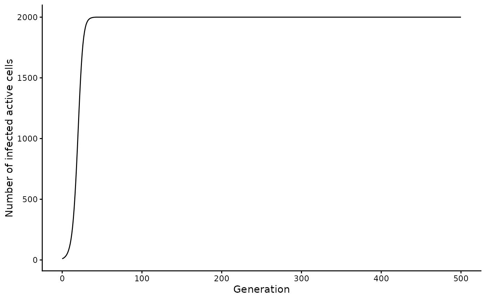
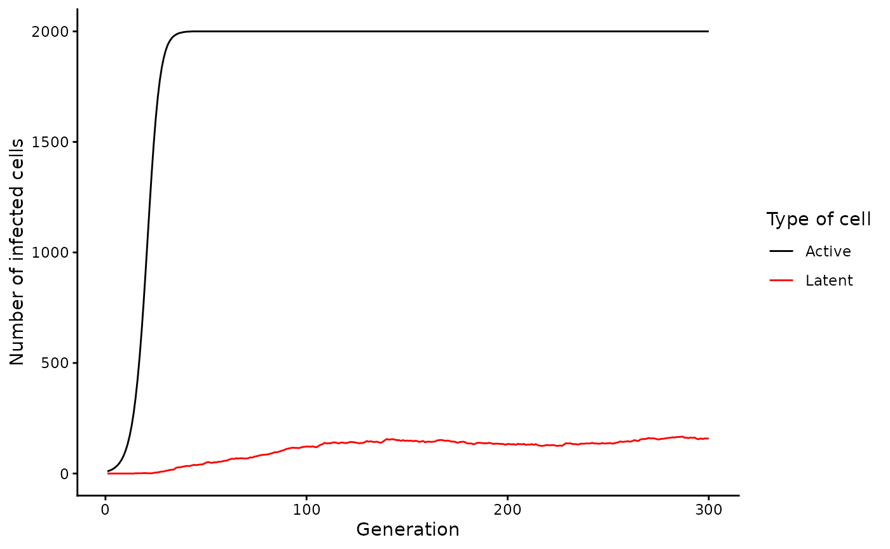
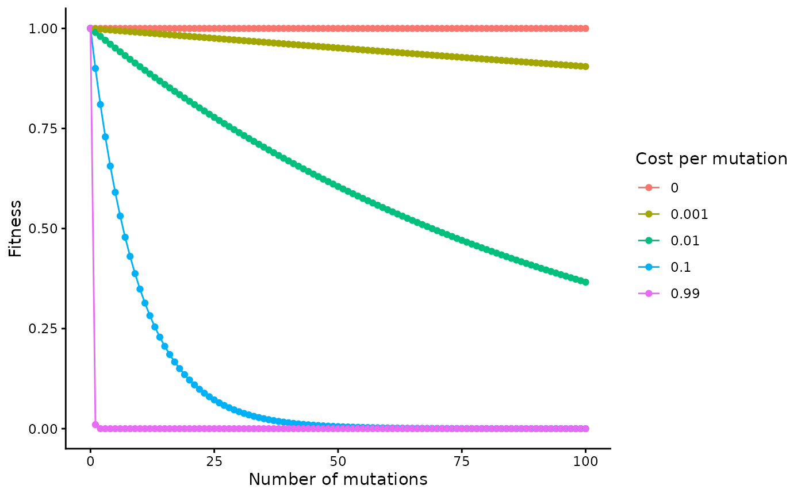
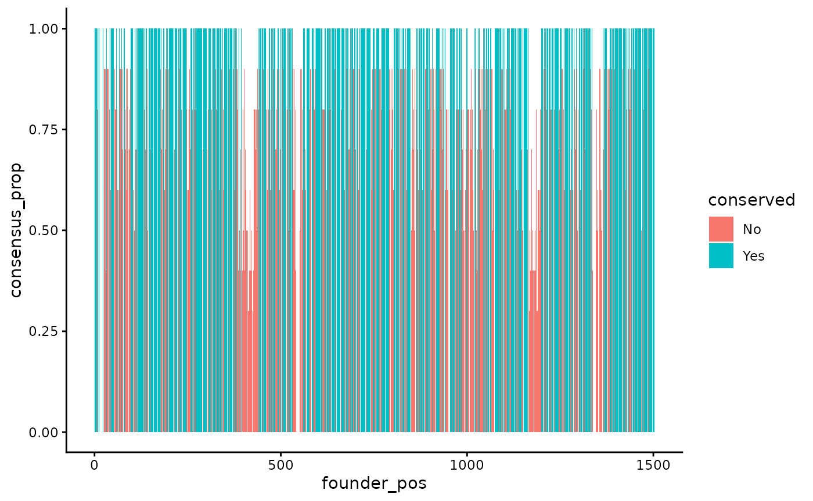
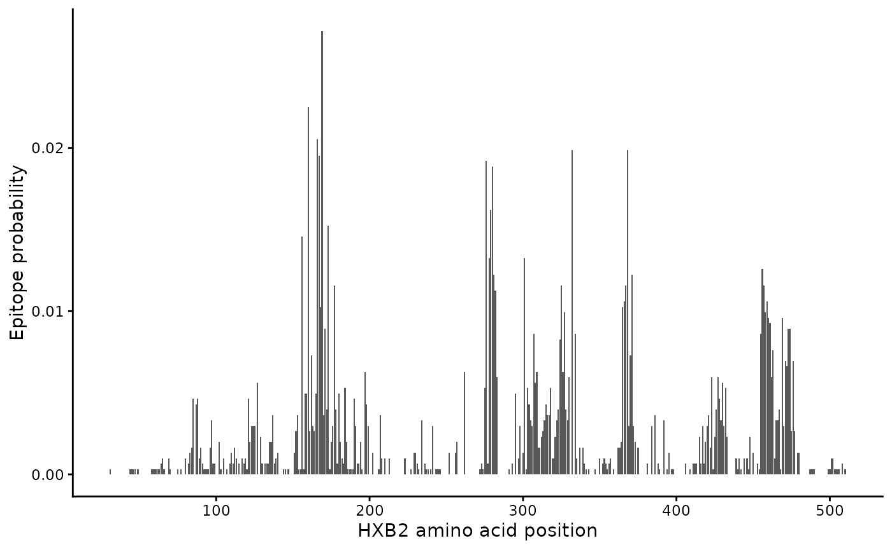
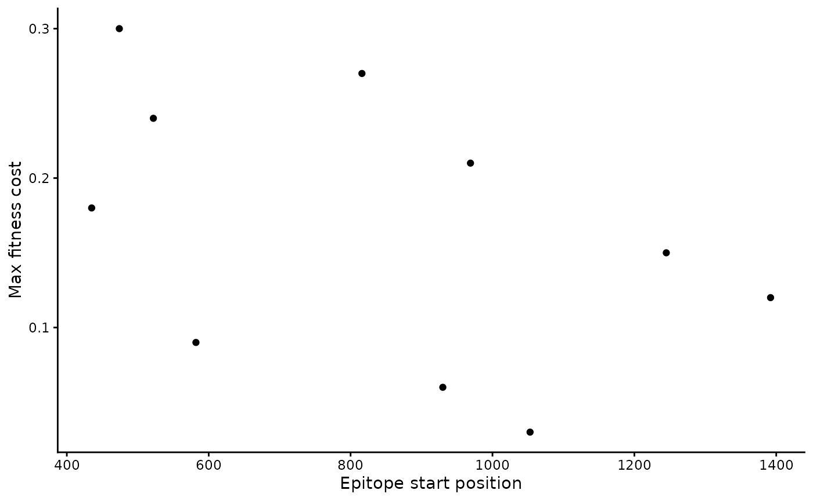
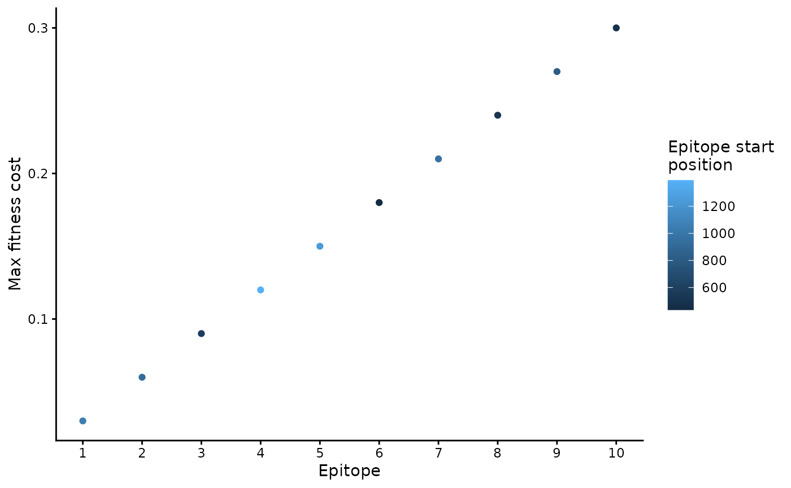

# Prepare input data

wavess is an individual-based discrete-time within-host evolution
simulator. We assume that all virus life cycles within the infection are
synchronized into generations. Each generation is one full virus life
cycle, from infecting one cell to exiting the cell and infecting the
next one.

This vignette describes how to generate input data for running wavess
using functions from the package, as summarized in the table below.
Please note that you may also generate the input data on your own, which
may be necessary if your inputs require more customization than these
functions provide. However, we expect these functions to be sufficient
for most users.

| [`run_wavess()`](https://molevolepid.github.io/wavess/reference/run_wavess.md) argument | `wavess` function to generate input | Description |
|----|----|----|
| `inf_pop_size` | [`define_growth_curve()`](https://molevolepid.github.io/wavess/reference/define_growth_curve.md) | [Define active cell growth](#define-active-cell-growth) |
| `samp_scheme` | `define_samp_scheme()` | [Define sampling scheme](#define-sampling-scheme) |
| `founder_seqs` | [`extract_seqs()`](https://molevolepid.github.io/wavess/reference/extract_seqs.md) | [Extract founder sequence from an alignment](#extract-founder-sequence-from-an-alignment) |
| `q` | [`estimate_q()`](https://molevolepid.github.io/wavess/reference/estimate_q.md) | [Determine nucleotide substitution probabilities](#estimate-q-matrix) |
| `conserved_sites` | [`identify_conserved_sites()`](https://molevolepid.github.io/wavess/reference/identify_conserved_sites.md) | [Identify conserved sites](#identify-conserved-sites) |
| `ref_seq` | [`identify_conserved_sites()`](https://molevolepid.github.io/wavess/reference/identify_conserved_sites.md), [`extract_seqs()`](https://molevolepid.github.io/wavess/reference/extract_seqs.md) | [Get reference sequence that is considered to be the best replicator](#find-a-consensus-sequence) |
| `b_epitope_locations` | [`get_epitope_frequencies()`](https://molevolepid.github.io/wavess/reference/get_epitope_frequencies.md), [`sample_epitopes()`](https://molevolepid.github.io/wavess/reference/sample_epitopes.md) | [Sample epitopes](#sample-epitopes) |
| `t_epitope_locations` |  | [Identify T epitopes](#get-t-epitopes) |

Each of the sections below goes into more detail.

We also provide examples of how to save the data. This can be useful if
generating the input data takes a while to run or if, rather than using
the built-in
[`run_wavess()`](https://molevolepid.github.io/wavess/reference/run_wavess.md)
function, you’d rather run it using a python command line script (see
[`vignette("python")`](https://molevolepid.github.io/wavess/articles/python.md)
for details). We save the files to a directory called `input_data`. If
you would like to do the same, you will have to create that directory
before running the file saving commands. For example:

``` r

dir.create("input_data")
#> Warning in dir.create("input_data"): 'input_data' already exists
```

In each relevant section, we also provide examples of how to visualize
the data.

## Install and load `wavess`

First, you need to install (if needed) and load the `wavess` library, as
well as a few others, and we will set the plotting theme and a seed:

``` r

# install.packages("remotes")
# remotes::install_github("MolEvolEpid/wavess")
# install.packages("ggplot2")

library(wavess)
library(readr)
library(tibble)
library(dplyr)
#> 
#> Attaching package: 'dplyr'
#> The following objects are masked from 'package:stats':
#> 
#>     filter, lag
#> The following objects are masked from 'package:base':
#> 
#>     intersect, setdiff, setequal, union
library(tidyr)
library(ggplot2)
library(ape)
#> 
#> Attaching package: 'ape'
#> The following object is masked from 'package:dplyr':
#> 
#>     where

theme_set(theme_classic())

# set seed
set.seed(1234)
```

This will also load some example data that we will be using in this
vignette. All of this example data is related to the HIV gp120 protein.
Please note that the default parameters for
[`run_wavess()`](https://molevolepid.github.io/wavess/reference/run_wavess.md)
are also based on this example.

In particular, we include the following example data in the package:

- `hxb2_cons_founder`: an alignment in
  [`ape::DNAbin`](https://rdrr.io/pkg/ape/man/DNAbin.html) format that
  includes the HIV full-genome sequence for the HXB2 reference sequence,
  the consensus sequence, and an example founder sequence.
- `hiv_mut_rates`: per-site per-day rates of change between specific
  nucleotides
- `hiv_env_flt_2022`: the first 10 sequences from the filtered HIV ENV
  alignment downloaded from the [LANL HIV sequence
  database](https://www.hiv.lanl.gov/content/sequence/NEWALIGN/align.html),
  in [`ape::DNAbin`](https://rdrr.io/pkg/ape/man/DNAbin.html) format.
  Feel free to download the entire alignment if you’d like.
- `conserved_sites`: a vector of conserved sites for the example founder
  sequence. More details on this below.
- `env_features`: a tibble of binding, contact, and and neutralization
  features for HIV ENV from the [LANL HIV immunology
  database](https://www.hiv.lanl.gov/components/sequence/HIV/neutralization/download_db.comp).

You can check out the documentation for these datasets for more details.

If you want to load your own data, you can use
[`ape::read.dna()`](https://rdrr.io/pkg/ape/man/read.dna.html) or
[`ape::read.FASTA()`](https://rdrr.io/pkg/ape/man/read.dna.html) to load
alignment files and
[`readr::read_delim()`](https://readr.tidyverse.org/reference/read_delim.html)
to load delimited files.

## Required `run_wavess()` inputs

The three required inputs to `run_waves()` are a data frame of the
infected cell population size for each *generation*, a data frame
including the *days* on which to sample and how many sequences to sample
(`samp_scheme`), and a vector of the founder sequence(s) in character
string format (`founder_seqs`). In this section, we will introduce
functions that can help generate these inputs.

Note that, in general, some of the inputs are in units of generations
and some are in units of days. We made these decisions mainly based on
what information is most readily available in the literature related to
each parameter value.

### Define active cell growth

[`run_wavess()`](https://molevolepid.github.io/wavess/reference/run_wavess.md)
requires a `inf_pop_size` data frame as input where each row is a
generation with the following columns:

- `generation`: Each generation to be simulated (must be consecutive
  whole numbers starting with 0)
- `active_cell_count`: Number of active infected cells in each
  generation

You can create this data frame yourself, but we also provide a helper
function to generate it:
[`define_growth_curve()`](https://molevolepid.github.io/wavess/reference/define_growth_curve.md).

All of the arguments in this function have defaults, so you can run:

``` r

define_growth_curve()
#> # A tibble: 5,001 × 2
#>    generation active_cell_count
#>         <dbl>             <dbl>
#>  1          0                10
#>  2          1                13
#>  3          2                17
#>  4          3                22
#>  5          4                29
#>  6          5                37
#>  7          6                48
#>  8          7                62
#>  9          8                80
#> 10          9               103
#> # ℹ 4,991 more rows
```

This will generate an infected cell population size following a logistic
growth curve. By default, the starting population size (`n0`) is 10, the
carrying capacity (`carry_cap`) is 2000, the maximum growth rate
(`max_growth_rate`) is 0.3, and the simulation is run for a maximum 5000
generations (`n_gen`). All of these defaults can be changed by altering
the input parameters of the function.

Here is an example where we allow the simulation to run for longer (for
as long as sequences are being sampled):

``` r

(inf_pop_size <- define_growth_curve(n_gen = 10000))
#> # A tibble: 10,001 × 2
#>    generation active_cell_count
#>         <dbl>             <dbl>
#>  1          0                10
#>  2          1                13
#>  3          2                17
#>  4          3                22
#>  5          4                29
#>  6          5                37
#>  7          6                48
#>  8          7                62
#>  9          8                80
#> 10          9               103
#> # ℹ 9,991 more rows
```

If you’d like to write this to a file:

``` r

write_csv(inf_pop_size, "input_data/inf_pop_size.csv")
```

A couple notes:

- The number of founders must equal the initial population size.
- Note that if you start with multiple different founder sequences, you
  may stochastically lose some of those sequences after generation
  0.  

You can visualize the active cell dynamics over time using the following
code:

``` r

# plot active cell counts
inf_pop_size |>
  filter(generation <= 500) |>
  ggplot(aes(x = generation, y = active_cell_count)) +
  geom_line() +
  labs(x = "Generation", y = "Number of infected active cells")
```



### Define sampling scheme

[`run_wavess()`](https://molevolepid.github.io/wavess/reference/run_wavess.md)
requires a `samp_scheme` data frame as input where each row is a *day*
with the following columns:

- `day`: Each day on which to sample sequences
- `n_sample_active`: Number of sequences from active cells to sample for
  that day (note that in the simulation output, this number may be lower
  if the population size is smaller than the requested number of
  sequences to sample)
- `n_sample_latent`: Number of sequences from latent cells to sample for
  that day (note that in the simulation output, this number may be lower
  if the population size is smaller than the requested number of
  sequences to sample)

You can create this data frame yourself, but we also provide a helper
function to generate it:
[`define_sampling_scheme()`](https://molevolepid.github.io/wavess/reference/define_sampling_scheme.md).

All of the arguments in this function have defaults, so you can run:

``` r

define_sampling_scheme()
#> # A tibble: 11 × 3
#>      day n_sample_active n_sample_latent
#>    <int>           <dbl>           <dbl>
#>  1     0              20              20
#>  2   365              20              20
#>  3   730              20              20
#>  4  1095              20              20
#>  5  1460              20              20
#>  6  1825              20              20
#>  7  2190              20              20
#>  8  2555              20              20
#>  9  2920              20              20
#> 10  3285              20              20
#> 11  3650              20              20
```

This will lead to sampling a maximum of 20 sequences (`max_samp`) every
365 days (`sampling_frequency`) for 3650 days (`n_days`).

Here is an example with sampling over a shorter time period, but more
frequent sampling and fewer samples taken at each sampling event:

``` r

(samp_scheme <- define_sampling_scheme(
  sampling_frequency_active = 30,
  max_samp_active = 10,
  n_days = 365
))
#> # A tibble: 14 × 3
#>      day n_sample_active n_sample_latent
#>    <int>           <dbl>           <dbl>
#>  1     0              10              20
#>  2    30              10               0
#>  3    60              10               0
#>  4    90              10               0
#>  5   120              10               0
#>  6   150              10               0
#>  7   180              10               0
#>  8   210              10               0
#>  9   240              10               0
#> 10   270              10               0
#> 11   300              10               0
#> 12   330              10               0
#> 13   360              10               0
#> 14   365               0              20
```

Note that the simulation will automatically end after the last sampling
time, even if the growth curve continues for more generations.

If you’d like to write this to a file:

``` r

write_csv(samp_scheme, "input_data/samp_scheme.csv")
```

### Extract founder sequence from an alignment

[`run_wavess()`](https://molevolepid.github.io/wavess/reference/run_wavess.md)
takes as input a character vector of founder sequence(s)
(`founder_seqs`). All sequences must be the same length and not contain
gaps.

We provide the function
[`extract_seqs()`](https://molevolepid.github.io/wavess/reference/extract_seqs.md)
to extract a founder sequence from an alignment in
[`ape::DNAbin`](https://rdrr.io/pkg/ape/man/DNAbin.html) format and
convert it into a character vector. The alignment can be read in using
[`ape::read.FASTA()`](https://rdrr.io/pkg/ape/man/read.dna.html) or
[`ape::read.dna()`](https://rdrr.io/pkg/ape/man/read.dna.html).

NOTE: We do not recommend using this function to extract more than one
founder sequence to initiate a single simulation because if any gaps are
present then the founder sequences will not be the same length, which
will lead to an error. Rather, if you would like to simulate multiple
founders, we recommend aligning all the founder sequences and then
stripping gaps such that the alignment remains codon-aligned, especially
if you plan to simulate immune fitness because epitopes are translated
to amino acids to calculate immune fitness costs.

This alignment is of the entire HIV genome, but we’re only interested in
the ENV gp120 gene, which we can subset to using the `start` and `end`
arguments.

To do this, we first have to know what the start and end positions of
gp120 are in the alignment. We know the start and end positions of gp120
in HXB2 from
[here](https://www.hiv.lanl.gov/content/sequence/HIV/MAP/landmark.html)
(6225 and 7757). To get the start and end positions in our alignment, we
can therefore find what alignment positions correspond to these HXB2
coordinates:

``` r

gp120_start <- which(cumsum(as.character(
  hxb2_cons_founder["B.FR.83.HXB2_LAI_IIIB_BRU.K03455", ]
) != "-") == 6225)[1]
gp120_end <- which(cumsum(as.character(
  hxb2_cons_founder["B.FR.83.HXB2_LAI_IIIB_BRU.K03455", ]
) != "-") == 7757)[1]
```

Then we can use these start and end positions to extract gp120 for our
founder sequence:

``` r

founder_seq <- extract_seqs(hxb2_cons_founder, "B.US.2011.DEMB11US006.KC473833",
  start = gp120_start, end = gp120_end
)$founder
```

This function can also take a reference sequence name (`ref_name`),
which can be used as the input to the `ref_seq` argument in
[`run_wavess()`](https://molevolepid.github.io/wavess/reference/run_wavess.md).
More on this later.

The easiest way to save this sequence as a fasta file is to convert it
into an [`ape::DNAbin`](https://rdrr.io/pkg/ape/man/DNAbin.html) object
and then save it:

``` r

rep(list(strsplit(founder_seq, "")[[1]]), 10) |>
  as.DNAbin() |>
  as.matrix() |>
  write.FASTA("input_data/founder.fasta")
```

### Estimate Q matrix

The model requires as input a Q matrix (`q`), which defines the rates of
nucleotide substitution for each possible transition between
nucleotides. By default, this matrix is estimated from approximately
neutral sites:

``` r

(hiv_q_mat <- calc_q_from_rates(hiv_mut_rates, mut_rate = 2.4e-5, generation_time = 1.2))
#>            A          C          G          T
#> A -1.3935602  0.1650215  1.1002145  0.1283242
#> C  0.9167813 -3.2089352  0.0915972  2.2005567
#> G  2.9338881  0.0182889 -3.3189236  0.3667466
#> T  0.5499598  1.8338005  0.5501132 -2.9338736
```

This matrix is based on the rates from [Zanini et al.
2017](https://doi.org/10.1093/ve/vex003), and is converted to an
approximate Q matrix by dividing by the estimated overall nucleotide
substitution rate.

**If you are simulating an organism other than HIV, you will want to
provide a Q matrix estimated for that organism.** Any phylogenetic tree
building program will estimate a Q matrix. For instance, the Q matrix is
returned when estimating a tree using [IQ-TREE](http://www.iqtree.org/)
(in the .iqtree output file). We also provide the function
[`estimate_q()`](https://molevolepid.github.io/wavess/reference/estimate_q.md)
to estimate Q from a multiple sequence alignment (in
[`ape::DNAbin`](https://rdrr.io/pkg/ape/man/DNAbin.html) format)
directly in R. Ideally, the input for this function would be an
alignment of sequences from within-host evolution of a representative
person. However, we have found that the simulation output is relatively
robust to variations in the Q matrix, so if you don’t have a within-host
alignment, then you can input an alignment with somewhat closely related
sequences (e.g. from the same subtype). The function outputs a Q matrix
where the rows are the “from” nucleotide and the columns are the “to”
nucleotide.

Here is an example (but note that this matrix isn’t accurate because
it’s simply a random set of sequences):

``` r

estimate_q(hiv_env_flt_2022)
#> optimize edge weights:  -13347 --> -13272.97 
#> optimize rate matrix:  -13272.97 --> -12963.97 
#> optimize invariant sites:  -12963.97 --> -12460.48 
#> optimize free rate parameters:  -12460.48 --> -10603 
#> optimize edge weights:  -10603 --> -10590.63 
#> optimize rate matrix:  -10590.63 --> -10581.46 
#> optimize invariant sites:  -10581.46 --> -10581.46 
#> optimize free rate parameters:  -10581.46 --> -10577.81 
#> optimize edge weights:  -10577.81 --> -10577.48 
#> optimize rate matrix:  -10577.48 --> -10577.26 
#> optimize invariant sites:  -10577.26 --> -10577.26 
#> optimize free rate parameters:  -10577.26 --> -10575.89 
#> optimize edge weights:  -10575.89 --> -10575.83 
#> optimize rate matrix:  -10575.83 --> -10575.79 
#> optimize invariant sites:  -10575.79 --> -10575.79 
#> optimize free rate parameters:  -10575.79 --> -10575.18 
#> optimize edge weights:  -10575.18 --> -10575.16 
#> optimize rate matrix:  -10575.16 --> -10575.14 
#> optimize invariant sites:  -10575.14 --> -10575.14 
#> optimize free rate parameters:  -10575.14 --> -10574.92 
#> optimize edge weights:  -10574.92 --> -10574.91 
#> optimize rate matrix:  -10574.91 --> -10574.91 
#> optimize invariant sites:  -10574.91 --> -10574.91 
#> optimize free rate parameters:  -10574.91 --> -10574.84 
#> optimize edge weights:  -10574.84 --> -10574.84 
#> optimize rate matrix:  -10574.84 --> -10574.83 
#> optimize invariant sites:  -10574.83 --> -10574.83 
#> optimize free rate parameters:  -10574.83 --> -10574.82 
#> optimize edge weights:  -10574.82 --> -10574.81 
#> optimize rate matrix:  -10574.81 --> -10574.81 
#> optimize invariant sites:  -10574.81 --> -10574.81 
#> optimize free rate parameters:  -10574.81 --> -10574.81 
#> optimize edge weights:  -10574.81 --> -10574.81 
#> optimize rate matrix:  -10574.81 --> -10574.81 
#> optimize invariant sites:  -10574.81 --> -10574.81 
#> optimize free rate parameters:  -10574.81 --> -10574.8 
#> optimize edge weights:  -10574.8 --> -10574.8 
#> optimize rate matrix:  -10574.8 --> -10574.8 
#> optimize invariant sites:  -10574.8 --> -10574.8 
#> optimize free rate parameters:  -10574.8 --> -10574.8 
#> optimize edge weights:  -10574.8 --> -10574.8 
#> optimize rate matrix:  -10574.8 --> -10574.8 
#> optimize invariant sites:  -10574.8 --> -10574.8 
#> optimize free rate parameters:  -10574.8 --> -10574.8 
#> optimize edge weights:  -10574.8 --> -10574.8
#>            A          C          G          T
#> A -1.5940889  0.3894774  1.0395679  0.1650437
#> C  0.7692561 -2.0446348  0.1948555  1.0805232
#> G  1.5490726  0.1470087 -1.9302495  0.2341682
#> T  0.2459336  0.8152003  0.2341682 -1.2953020
```

By default, a neighbor joining tree is created using
`ape::bionj(ape::dist.dna(aln, model = 'TN93'))`. Instead, you can
provide an input tree (`tr`). From this, the Q matrix is computed with
[`phangorn::pml_bb()`](https://klausvigo.github.io/phangorn/reference/pml_bb.html)
using by default a GTR+I+R4 model of nucleotide substitution (`model`)
and no tree rearrangement (`rearrangement`).

To save this to a file:

``` r

data.frame(hiv_q_mat) |>
  rownames_to_column(var = "nt_from") |>
  write_csv("input_data/hiv_q_mat.csv")
```

**Note:** to read this back into R and get it into matrix form, you can
use this code:

``` r

as.matrix(read.csv("input_data/hiv_q_mat.csv", row.names = 1))
#>            A          C          G          T
#> A -1.3935602  0.1650215  1.1002145  0.1283242
#> C  0.9167813 -3.2089352  0.0915972  2.2005567
#> G  2.9338881  0.0182889 -3.3189236  0.3667466
#> T  0.5499598  1.8338005  0.5501132 -2.9338736
```

## Latent cell dynamics

The required inputs related to latency are per-day rates that these
events happen to a cell. (Note that to “turn off” any of these, all you
have to do is set the rate equal to 0.) It is helpful to visualize the
latent cell dynamics prior to simulating data with a given set of rates.
While the way the model implements latency is stochastic, meaning that a
different number of cells will become latent in each simulation, the
overall trends should be similar across simulations, given the same set
of rates.

To make these plots, you need the active cell counts, which can be
generated from the
[`define_growth_curve()`](https://molevolepid.github.io/wavess/reference/define_growth_curve.md)
function described above. We will therefore be using the `inf_pop_size`
dataset we created earlier in the vignette. Also, the rates related to
latency are converted to probabilities for simulation, so we will
convert them here before plotting.

**Please note that we assume the rates (and thus per-generation
probabilities) are small for all latency parameters**, such that it is
unlikely that multiple events (activate, die, proliferate) will occur to
a single latent cell in a single \[active cell\] generation. If multiple
events occur to a single latent cell, then the first event in this
ordered list will be chosen as the event that occurred to the cell in
that generation: cell becomes active, cell dies, cell proliferates.

``` r

# set parameters to get latent curve
to_latent <- 0.001
to_active <- 0.01
proliferation <- 0.01
death <- 0.01

# get latent cell count for each generation
latent <- 0
active_latent_counts <- lapply(inf_pop_size$active_cell_count, function(x) {
  n_to_latent <- rbinom(1, x, prob = to_latent)
  to_active <- rbinom(latent, 1, prob = to_active)
  to_proliferate <- rbinom(latent, 1, prob = proliferation)
  to_die <- rbinom(latent, 1, prob = death)
  n_to_active <- sum(to_active == 1)
  n_to_die <- sum((to_die - to_active) == 1)
  n_to_proliferate <- sum((to_proliferate - to_die - to_active) == 1)
  counts <- tibble(
    Active = x, Latent = latent, n_to_latent, n_to_active,
    n_to_proliferate, n_to_die
  )
  latent <<- latent + n_to_latent - n_to_active + n_to_proliferate - n_to_die
  return(counts)
}) |>
  bind_rows() |>
  mutate(gen = row_number())

# Plot (latent) cell counts
active_latent_counts |>
  filter(gen <= 300) |>
  pivot_longer(c(Active, Latent)) |>
  ggplot(aes(x = gen, y = value, col = name)) +
  geom_line() +
  # scale_y_log10() + # uncomment this if you want to scale the y axis by log10
  scale_color_manual(values = c("black", "red")) +
  labs(x = "Generation", y = "Number of infected cells", col = "Type of cell")
```



## Selection

`wavess` can simulate three types of selection: conserved sites,
replicative fitness relative to a reference sequence, and B-cell immune
selection at user-defined epitopes. By default, no selection is included
in the simulations. However, we recommend including selection to obtain
realistic model outputs.

Below, we describe how to generate the inputs for each of these
selective pressures.

### Fitness costs

Each of the different forms of selection has a fitness cost associated
with it. The fitness cost can be in the range \[0,1), where 0 indicates
no cost. 1, which indicates no ability to survive, is not allowed as we
assume that we are only simulating scenarios where infection is
established and the viruses are at least somewhat viable. However, using
a very high fitness cost, e.g. of 0.99, effectively simulates purifying
selection due to the compounding nature of the fitness cost over many
generations.

The fitness, F, of a virus is defined by the product of the fitness of
each component:

``` math
F=F_C*F_R*F_I
```
where $`F_C`$ is the conserved fitness, $`F_R`$ is the replicative
fitness, and $`F_I`$ is the immune fitness.

The equation used to compute $`F_C`$ and $`F_R`$ is:

``` math
F_{C/R} = (1-c)^n
```
Where $`c`$ is either the conserved fitness cost or the replicative
fitness cost, and $`n`$ is the number of mutations at conserved sites or
the number of sites that differ from the reference sequence,
respectively.

When both forms of fitness are used, if the position is considered to be
a conserved site, then it is not considered for replicative fitness.

Here is a plot of how the cost and number of mutations influences
overall fitness:

``` r

costs <- c(0, 0.001, 0.01, 0.1, 0.99)
n_muts <- 0:100
tibble(n_mut = sort(rep(n_muts, length(costs))), cost = rep(costs, length(n_muts))) |>
  mutate(fitness = (1 - cost)**n_mut) |>
  ggplot(aes(x = n_mut, y = fitness, col = factor(cost))) +
  geom_line() +
  geom_point() +
  labs(x = "Number of mutations", y = "Fitness", col = "Cost per mutation")
```



The calculation of immune fitness is a bit more involved, but the result
is that it is computed as the largest fitness cost across all
immune-recognized epitopes:

``` math
F_I = max(c_{epitope})
```
Where $`c_{epitope}`$ is a vector of the costs of each epitope
recognized by the immune system. Note that this cost changes over
generations. Please refer to the manuscript for more details.

In the next sections, we will discuss how to identify conserved sites,
create a reference sequence, and generate epitopes.

### An important note about indexing and reference sequences

First, all nucleotide positions must be indexed relative to the start of
the founder sequence in the simulation. Since the back-end is
implemented in Python, we expect the indexing to begin at 0. This is
because you can run wavess using the
[`run_wavess()`](https://molevolepid.github.io/wavess/reference/run_wavess.md)
function in R, but also directly from Python (see
[`vignette("python")`](https://molevolepid.github.io/wavess/articles/python.md)
for details). This way, the inputs are the same regardless of what
program you use to run wavess. This is relevant for conserved sites and
epitopes.

Second, information of interest such as conserved sites or antibody
contacts, is often computed or provided relative to what is called a
reference sequence. For HIV, the reference sequence is usually HXB2.
**This community reference sequence is different than how we define a
reference sequence in `wavess`.** The community reference sequence (e.g.
HXB2) is a standard that researchers use to more easily be able to share
and compare information. The reference sequence defined in `wavess` is
one that is believed to be representative of the “most fit” sequence
(when not under immune pressure), however you would like to think of it.

When information of interest is provided relative to the community
reference sequence, we must change the indexing of the information to be
relative to the founder sequence that will be used in the simulation.

The easiest way to ensure that the indexing is correct is to have an
alignment consisting of the founder sequence, the community reference
sequence (if needed), and the wavess reference sequence (if being used),
where the start and end of the alignment are the start and end of the
founder sequence to be used in the simulation.

If you have an alignment with sequences that are longer than the input
sequence you want to simulate, you can use the
[`slice_aln()`](https://molevolepid.github.io/wavess/reference/slice_aln.md)
function to slice out the desired section of the alignment. Here’s an
example:

``` r

(gp120 <- slice_aln(hxb2_cons_founder, gp120_start, gp120_end))
#> 3 DNA sequences in binary format stored in a matrix.
#> 
#> All sequences of same length: 1563 
#> 
#> Labels:
#> B.FR.83.HXB2_LAI_IIIB_BRU.K03455
#> CON_B(1295)
#> B.US.2011.DEMB11US006.KC473833
#> 
#> Base composition:
#>     a     c     g     t 
#> 0.381 0.160 0.214 0.245 
#> (Total: 4.69 kb)
```

We will use this alignment below.

### Identify conserved sites

In
[`run_wavess()`](https://molevolepid.github.io/wavess/reference/run_wavess.md)
you can provide a vector of conserved sites and the conserved nuceltoide
(`conserved_sites` argument). Mutations away from a conserved nucleotide
have a fitness cost defined by the `conserved_cost` argument.

To generate a vector of conserved sites from an alignment, you can use
the function
[`identify_conserved_sites()`](https://molevolepid.github.io/wavess/reference/identify_conserved_sites.md),
which outputs a data frame with 5 columns:

- `founder_pos`: the position in the founder
- `founder_base`: the base in the founder sequence
- `consensus_base`: the consensus base
- `consensus_prop`: the proportion of sequences that have the consensus
  base
- `conserved`: whether (‘Yes’) or not (‘No’) the site is considered
  conserved, based on the threshold value defined by the `thresh`
  argument (default: 0.99)

You can use this function in two ways. If you have an alignment that
includes the founder sequence of interest, all you need to provide is
the alignment in
[`ape::DNAbin`](https://rdrr.io/pkg/ape/man/DNAbin.html) format and the
name of the founder sequence in the alignment. Note that the function
assumes that the alignment consists of only the segment of the founder
sequence that you want to simulate (i.e., the beginning of the alignment
is the beginning of the founder sequence that you want to simulate, and
the end of the alignment is the end of the sequence you want to
simulate).

We will be using the built-in `hiv_env_flt_2022` alignment as an
example. However, this contains only 10 sequences. **In reality, you
should use many more sequences.** For HIV, you can download the entire
filtered alignment for each gene or for the entire genome from the [LANL
HIV sequence
database](https://www.hiv.lanl.gov/content/sequence/NEWALIGN/align.html).

For the example founder gp120 sequence we use in the package
(B.US.2011.DEMB11US006.KC473833), we also provide a vector of conserved
sites for this founder sequence (`founder_conserved_sites`) for ease of
use.

First, since the `hxb2_cons_founder` sequence is all of *env*, but we
just want to simulate gp120, we have to slice out that part of the
alignment:

``` r

# get hxb2 gp120 length and end position in flt alignment
len_hxb2_gp120 <- nchar(extract_seqs(hxb2_cons_founder,
  "B.FR.83.HXB2_LAI_IIIB_BRU.K03455",
  start = gp120_start, end = gp120_end
)$founder)
flt_gp120_end <- which(cumsum(as.character(hiv_env_flt_2022[1, ]) != "-") ==
  len_hxb2_gp120)[1]
# subset to only gp120 section
hiv_gp120_flt_2022 <- slice_aln(hiv_env_flt_2022, 1, flt_gp120_end)
```

Then we can use this sliced alignment to identify conserved sites:

``` r

identify_conserved_sites(hiv_gp120_flt_2022, "B.FR.83.HXB2_LAI_IIIB_BRU.K03455")
#> # A tibble: 1,533 × 5
#>    founder_pos founder_base consensus_base consensus_prop conserved
#>          <dbl> <chr>        <chr>                   <dbl> <chr>    
#>  1           0 a            a                         1   Yes      
#>  2           1 t            t                         1   Yes      
#>  3           2 g            g                         1   Yes      
#>  4           3 a            a                         1   Yes      
#>  5           4 g            g                         1   Yes      
#>  6           5 a            a                         1   Yes      
#>  7           6 g            g                         1   Yes      
#>  8           7 t            t                         0.8 No       
#>  9           8 g            g                         1   Yes      
#> 10           9 a            a                         1   Yes      
#> # ℹ 1,523 more rows
```

Alternatively, if you have two alignments with a shared reference, one
from which you’d like to calculate conserved sites, and the other that
contains the founder, you can provide both alignments, as well as the
common reference, and the function will return the conserved sites
relative to the founder sequence. In this case, the shared reference
sequence is assumed to have the same start position in each alignment.

``` r

(founder_conserved_df <- identify_conserved_sites(hiv_gp120_flt_2022,
  founder = "B.US.2011.DEMB11US006.KC473833",
  ref = "B.FR.83.HXB2_LAI_IIIB_BRU.K03455",
  founder_aln = gp120
))
#> # A tibble: 1,503 × 5
#>    founder_pos founder_base consensus_base consensus_prop conserved
#>          <dbl> <chr>        <chr>                   <dbl> <chr>    
#>  1           0 a            a                         1   Yes      
#>  2           1 t            t                         1   Yes      
#>  3           2 g            g                         1   Yes      
#>  4           3 a            a                         1   Yes      
#>  5           4 g            g                         1   Yes      
#>  6           5 a            a                         1   Yes      
#>  7           6 g            g                         1   Yes      
#>  8           7 c            t                         0.8 No       
#>  9           8 g            g                         1   Yes      
#> 10           9 a            a                         1   Yes      
#> # ℹ 1,493 more rows
```

You can visualize the conserved sites across the genome using the
following code:

``` r

founder_conserved_df |>
  ggplot(aes(x = founder_pos, y = consensus_prop, fill = conserved)) +
  geom_col()
#> Warning: Removed 30 rows containing missing values or values outside the scale range
#> (`geom_col()`).
```



The blue sites are conserved, the red sites are not conserved, and the
y-axis indicates the proportion of sequences in the alignment that
contain the consensus base. **Note that this example only uses 10
sequences. We recommend using a large alignment with very diverse
sequences to identify conserved sites to ensure that the identified
sites are across many genetic backgrounds.**

While we provide information about each sequence in the output, the
input of `run_wavess` only takes a vector of the conserved sites. To
generate this, you can run the following code:

``` r

founder_conserved_sites_example <- founder_conserved_df |>
  filter(conserved == "Yes") |>
  select(founder_pos, founder_base) |>
  deframe() |>
  toupper()

head(founder_conserved_sites_example)
#>   0   1   2   3   4   5 
#> "A" "T" "G" "A" "G" "A"
tail(founder_conserved_sites_example)
#> 1497 1498 1499 1500 1501 1502 
#>  "A"  "A"  "A"  "A"  "G"  "A"
```

To write this to a file (note that we use the internal conserved sites
because it is more accurate for our example, rather than the example run
above, which is not accurate since it was only run on a handful of
genomes):

``` r

write_csv(enframe(founder_conserved_sites, name = "position", value = "nucleotide"), "input_data/founder_conserved_sites.csv")
```

### Find a consensus sequence

We have implemented a very crude way of generating a consensus sequence,
by taking the most common base at each position, and if there is a tie,
the base that comes first in the alphabet. The consensus sequence is
returned as part of the
[`identify_conserved_sites()`](https://molevolepid.github.io/wavess/reference/identify_conserved_sites.md)
output. If you would like more control over generating a consensus
sequence, you can use the [Consensus
Maker](https://www.hiv.lanl.gov/content/sequence/CONSENSUS/consensus.html)
tool on the LANL HIV website.

To convert the consensus sequence from above into the correct input
format for
[`run_wavess()`](https://molevolepid.github.io/wavess/reference/run_wavess.md),
you can use the following code, where NA values are converted to gaps:

``` r

gsub("NA", "-", paste0(founder_conserved_df$consensus_base, collapse = ""))
#> [1] "atgagagtgatgg---------ggacacagatg---aagtggagatgggggactatgatcttgggaatgataataatttgtagtgctacagaaaacttgtgggttactgtctactatggggtacctgtgtggaaagatgcagagaccaccctattttgtgcatcagatgctaaagcatatgatacagaagtgcataatgtctgggctacacatgcctgtgtacccacagaccccaacccacaagaaataaatttggaaaatgtgacagaagagtttaacatgtggaaaaataacatggtagaacagatgcataaagatataatcagtctatgggaccaaagcctaaagccatgtgtaaagttaacccctctctgtgttactttaaagtgcaatgactacaacaacaaca--aa---cactactacaactgaggaaggagaaataaaaaactgctctttcaatatgaccacagaattaagagataagaaacagaaagtatattcacttttttatagacttgatatagtacaaattgataataa---------t------aagtatagattaataaattgtaatacctcagccattacacaggcttgtccaaaggtatcctttgagccaattcccatacattattgtgccccagctggttttgcgattctaaagtgtaatgataaggagttcaatggaacaggaccatgcaagaatgtcagcacagtacaatgcacacatggaatcaagccagtagtatcaactcaactgctgttaaatggcagtctagcagaagaagagataatgattagatctgaaaatatcacagacaatgccaaaaccataatagtacaacttaataagcctgtaaaaattaattgtaccagacctaacaacaatacaagaaaaagtatacat--aggaccaggacaagcattctatgcaacaggtga---cataggggatataagaaaagcacattgtaatgtcagtagaacagaatggaataaaactttacaaaaggtagccaaacaattaagaaaacactttaacaaaacaataatcttt---aataattcaggaggggatttagaaattacaacacatagttttaattgtggaggagaatttttctactgcaacacatcaggcctgtttaatagcacttggaataaaaacaataacacaaaaaaaaataaaactataactctcccatgcagaataaagcaaattataaatatgtggcagagagcaggacaagcaatatatgcccctcccatccaaggagtaataaggtgtgaatcaaacattacaggactactattaacaagagatggtggaaa------taataaa------aataccgaaaccttcagacctggaggaggagatatgagggacaattggagaagtgaattatataaatataaagtagtaaaaattgaaccactaggagtagcacccaccaaggcaaaaagaagagtggtggagagagaaaaaaga"
```

If you have an alignment including the founder sequence and wavess
reference sequence you’d like to use, then you can also use the
[`extract_seqs()`](https://molevolepid.github.io/wavess/reference/extract_seqs.md)
function to obtain both at once:

``` r

(founder_ref <- extract_seqs(hxb2_cons_founder,
  founder = "B.US.2011.DEMB11US006.KC473833",
  ref = "CON_B(1295)",
  start = gp120_start, end = gp120_end
))
#> $founder
#> [1] "ATGAGAGCGATGGGGATCATGAGGAATTGGCAACACTTGTGGAGATGGGGCATGATGCTCCTTGGGATGTTGATGATCTGTAATGCTACAGACAACTTGTGGGTCACAGTCTATTATGGGGTACCTGTGTGGAGGGAAGCAAACACAACTCTATTTTGTGCATCAGATGCTAAAGCATATGAGACAGAGGTACATAATGTTTGGGCCACACATGCCTGTGTACCCACAGACCCCAACCCACAAGAAGTAAAATTGGGAAATGTGACAGAAAATTTTAATGCATGGAAAAATGACATGGTAGAACAGATGCATGAGGATATAATCAGTCTATGGGATCAAAGCCTAAAGCCATGTGTAAGATTAACCCCACTCTGTGTTACTCTAAATTGCACTGATCTTAATGCCACTAGCATTGGTAGTAACATGACACTGAAGGGAGAAATAAAAAATTGCACTTTCAATATCACCACAAGTAAAAACGATAAAAAGACAACAGAACGTGCATATTTTAATAGACTTGATGTGGTACCAATGGATGATAATAGTAGTAGTAGTACTAGTTATAGGTTGATAAGTTGTAACACCTCAGTCATTACACATGCCTGCCCAAAGGTATCCTTTGAGCCAATTCCCATACATTATTGTGCCCCAGCTGGTTTTGCGATTCTAAAGTGTAATGATAAAAAATTTAATGGAAAAGGACTATGTAAAAATGTCAGCACAGTACAATGTACACATGGAATTAGACCAGTAGTATCAACTCAACTGTTGCTGAATGGCAGTCTAGCAGAAGAAGAAGTAGTAATTAGATCTGAAAATATCTCTAACAATGCCAAAACCATAATAGTACATCTGAAGGAATCTGTACAAATTATTTGTGTAAGACCCAACAACAATACAAGACAAGGTATACATATGGGACCAGGAAGGACATTTTATACAACAGGGGGGATAATAGGAGATATAAGGCAAGCATATTGTAACATTAGTAGGGCAGAATGGACTAACACTCTAGGAAAGATAGTTGGAAAATTAAGAGAACGATTTAATAAAACAATAATCTTTAATCATTCCTCAGGAGGGGACCTAGAAATTGTGACACACAGTTTTAATTGTGGAGGGGAATTTTTCTACTGCAATACATCAGCACTGTTTAATAGTACTTGGAATAGTACTATAAATACAAGTGAAAATGACACAATCATACTCCCATGCAGAATAAAACAAATTATAAATCTGTGGCAGGAAGTAGGAAGAGCAATGTATGCTCCTCCCATCAGGGGAAACATTAGCTGTACATCAAATATTACGGGGGTGCTATTAACAAGAGATGGTGGCGATGACCCTAACGGGACCAACGACACCGAGACCTTCAGACCTGGAGGAGGAGATATGAGGGACAATTGGAGAAATGAATTGTATAAATACAAAGTAGTAAAAATTGAACCATTGGGAATAGCACCCACCAGGGCAAAGAGAAGAGTGGTGCAAAGAGAAAAAAGA"
#> 
#> $ref
#> [1] "ATGAGAGTGAAGGGGATCAGGAAGAATTATCAGCACTTGTGGAGATGGGGCATCATGCTCCTTGGGATGTTGATGATCTGTAGTGCTGCAGAAAAATTGTGGGTCACAGTCTATTATGGGGTACCTGTGTGGAAAGAAGCAACCACCACTCTATTTTGTGCATCAGATGCTAAAGCATATGATACAGAGGTACATAATGTTTGGGCCACACATGCCTGTGTACCCACAGACCCCAACCCACAAGAAGTAGTATTGGAAAATGTGACAGAAAATTTTAACATGTGGAAAAATAACATGGTAGAACAGATGCATGAGGATATAATCAGTTTATGGGATCAAAGCCTAAAGCCATGTGTAAAATTAACCCCACTCTGTGTTACTTTAAATTGCACTGATTTTAATACTAATAATAATAATACTAATA-TA-TATGAAAGGAGAAATAAAAAACTGCTCTTTCAATATCACCACAAGCATAAGAGATAAGATGCAGAAAGAATATGCACTTTTTTATAAACTTGATGTAGTACCAATAGATAATGA---------TAATACTAGCTATAGGTTGATAAGTTGTAACACCTCAGTCATTACACAGGCCTGTCCAAAGGTATCCTTTGAGCCAATTCCCATACATTATTGTGCCCCGGCTGGTTTTGCGATTCTAAAGTGTAATGATAAGAAGTTCAATGGAACAGGACCATGTAAAAATGTCAGCACAGTACAATGTACACATGGAATTAGGCCAGTAGTATCAACTCAACTGCTGTTAAATGGCAGTCTAGCAGAAGAAGAGGTAGTAATTAGATCTGAAAATTTCACAGACAATGCTAAAACCATAATAGTACAGCTGAATGAATCTGTAGAAATTAATTGTACAAGACCCAACAACAATACAAGAAAAAGTATACATATAGGACCAGGGAGAGCATTTTATGCAACAGGAGAAATAATAGGAGATATAAGACAAGCACATTGTAACATTAGTAGAGCAAAATGGAATAACACTTTAAAACAGATAGTTAAAAAATTAAGAGAACAATTTAATAAAACAATAGTCTTTAATCAATCCTCAGGAGGGGACCCAGAAATTGTAATGCACAGTTTTAATTGTGGAGGGGAATTTTTCTACTGTAATACAACACAACTGTTTAATAGTACTTGGAATAATAATAATA-TACTAAAAAAAATGAAACTATCACACTCCCATGCAGAATAAAACAAATTATAAACATGTGGCAGGAAGTAGGAAAAGCAATGTATGCCCCTCCCATCAGAGGACAAATTAGATGTTCATCAAATATTACAGGGCTGCTATTAACAAGAGATGGTGGTAA------TAATAATA--AACAACACTGAGACCTTCAGACCTGGAGGAGGAGATATGAGGGACAATTGGAGAAGTGAATTATATAAATATAAAGTAGTAAAAATTGAACCATTAGGAGTAGCACCCACCAAGGCAAAGAGAAGAGTGGTGCAGAGAGAAAAAAGA"
```

It’s okay if the reference sequence has gaps. These will be ignored when
computing fitness relative to the reference.

To write this to a fasta file, you use a similar method as writing the
founder to a fasta file:

``` r

strsplit(founder_ref$ref, "")[[1]] |>
  as.DNAbin() |>
  as.matrix() |>
  write.FASTA("input_data/ref.fasta")
```

### Sample epitopes

Immune fitness in `wavess` is defined by epitope locations in the
sequence, each of which can have a maximum fitness cost between 0 and 1.
These are defined at the amino acid level, so they must both be within a
nucleotide sequence that is translated to a protein and in the correct
reading frame. Note that, currently, epitope locations must all be the
same length.

While you can define your own epitope locations, we provide the function
[`sample_epitopes()`](https://molevolepid.github.io/wavess/reference/sample_epitopes.md)
that, given epitope probabilities for each *amino acid* position of
interest, will return randomly sampled *nucleoitde* epitope locations
based on the probability of an epitope occurring at that location.
Therefore, the function
[`sample_epitopes()`](https://molevolepid.github.io/wavess/reference/sample_epitopes.md)
takes as input a data frame that must contain columns for the amino acid
position (`aa_position`) and the epitope probability at that position
(`epitope_probability`). The amino acid positions must only include
those corresponding to the nucleotide sequence to be simulated, and must
be indexed in such a way that the first amino acid position corresponds
to the first nucleotide position in the founder sequence. In our
example, this is gp120. We have already filtered the built-in package
data to only include this subset.

If possible, we recommend determining epitope probabilities based on
some sort of known antibody contact/binding/neutralization maps. For HIV
ENV gp120, we used the features from the LANL HIV immunology database:

``` r

env_features
#> # A tibble: 3,022 × 13
#>       ID Title                   Reference `Feature type` `Mab(s)(Binding type)`
#>    <dbl> <chr>                   <chr>     <chr>          <chr>                 
#>  1     4 PGT121 epitope defined… Mouquet2… binding        PGT121(V3)            
#>  2     4 PGT121 epitope defined… Mouquet2… binding        PGT121(V3)            
#>  3     4 PGT121 epitope defined… Mouquet2… binding        PGT121(V3)            
#>  4     4 PGT121 epitope defined… Mouquet2… binding        PGT121(V3)            
#>  5     4 PGT121 epitope defined… Mouquet2… binding        PGT121(V3)            
#>  6     4 PGT121 epitope defined… Mouquet2… binding        PGT121(V3)            
#>  7     4 PGT121 epitope defined… Mouquet2… binding        PGT121(V3)            
#>  8     4 PGT121 epitope defined… Mouquet2… binding        PGT121(V3)            
#>  9     4 PGT121 epitope defined… Mouquet2… binding        PGT121(V3)            
#> 10     4 PGT121 epitope defined… Mouquet2… binding        PGT121(V3)            
#> # ℹ 3,012 more rows
#> # ℹ 8 more variables: `Experimental method(s)` <chr>, Position <dbl>,
#> #   `Env feature(s)` <chr>, `HXB2 AA` <chr>, `Entropy M` <dbl>,
#> #   `Entropy B` <dbl>, `Entropy C` <dbl>, Annotation <chr>
```

All we need is the positions column, but we provide the rest of the
information for reference.

If you don’t have this information, you can use uniformly distributed
probabilities, or some other informed guess as to where the
probabilities for epitopes binding is higher.

We can put the positions into the
[`get_epitope_frequencies()`](https://molevolepid.github.io/wavess/reference/get_epitope_frequencies.md)
function, which returns a tibble with three columns:

- `aa_pos`: amino acid position
- `n_features`: the number of features at that position
- `epitope_probability`: the probability of an epitope at that position,
  given the input positions

``` r

(epi_probs <- get_epitope_frequencies(env_features$Position))
#> # A tibble: 480 × 3
#>    aa_position n_features epitope_probability
#>          <dbl>      <dbl>               <dbl>
#>  1          31          1            0.000331
#>  2          32          0            0       
#>  3          33          0            0       
#>  4          34          0            0       
#>  5          35          0            0       
#>  6          36          0            0       
#>  7          37          0            0       
#>  8          38          0            0       
#>  9          39          0            0       
#> 10          40          0            0       
#> # ℹ 470 more rows
```

We can visualize it as follows:

``` r

epi_probs |>
  ggplot(aes(x = aa_position, y = epitope_probability)) +
  geom_col() +
  labs(x = "HXB2 amino acid position", y = "Epitope probability")
```



This information can be used as input to the
[`sample_epitopes()`](https://molevolepid.github.io/wavess/reference/sample_epitopes.md)
function. Note that the output of this function is different each time
it’s run, since the locations are selected randomly each time.

``` r

sample_epitopes(epi_probs)
#> 2 resamples required
#> # A tibble: 10 × 3
#>    epi_start_nt epi_end_nt max_fitness_cost
#>           <dbl>      <dbl>            <dbl>
#>  1          483        513             0.03
#>  2          906        936             0.06
#>  3          981       1011             0.09
#>  4          822        852             0.12
#>  5         1083       1113             0.15
#>  6         1488       1518             0.18
#>  7          525        555             0.21
#>  8          405        435             0.24
#>  9          441        471             0.27
#> 10         1368       1398             0.3
```

The function returns start and end *nucleotide* positions for each
epitope, relative to the input amino acid positions.

There are many ways to customize the output of this function. You can
provide the starting (`start_aa_pos`) and ending (`end_aa_pos`) amino
acid positions to consider for epitope sampling (here we’ve pre-subset
to only gp120 features), the number of epitopes to sample
(`num_epitopes`), the amino acid epitope length (`aa_epitope_length`),
and the maximum fitness cost of an epitope (`max_fit_cost`).

If the amino acid positions are relative to a community reference
sequence, then you will also need to create a map between the community
reference and your founder sequence so that the data can be re-indexed
to the founder sequence. In this case, the amino acid positions we used
are from HXB2, so we want to map them to our founder sequence. You
should use an alignment that contains the exact founder sequence you
plan to simulate (no longer and no shorter). Once you have this
alignment (e.g. using the
[`slice_aln()`](https://molevolepid.github.io/wavess/reference/slice_aln.md)
function described above), you can use the
[`map_ref_founder()`](https://molevolepid.github.io/wavess/reference/map_ref_founder.md)
function, which returns reference and founder positions mapped to each
other:

``` r

(ref_founder_map <- map_ref_founder(gp120,
  ref = "B.FR.83.HXB2_LAI_IIIB_BRU.K03455",
  founder = "B.US.2011.DEMB11US006.KC473833"
))
#> # A tibble: 1,563 × 5
#>    alignment_pos ref_pos founder_pos ref_base founder_base
#>            <dbl>   <dbl>       <dbl> <chr>    <chr>       
#>  1             0       0           0 a        a           
#>  2             1       1           1 t        t           
#>  3             2       2           2 g        g           
#>  4             3       3           3 a        a           
#>  5             4       4           4 g        g           
#>  6             5       5           5 a        a           
#>  7             6       6           6 g        g           
#>  8             7       7           7 t        c           
#>  9             8       8           8 g        g           
#> 10             9       9           9 a        a           
#> # ℹ 1,553 more rows
```

You can input this into
[`sample_epitopes()`](https://molevolepid.github.io/wavess/reference/sample_epitopes.md),
which will then return nucleotide positions relative to the founder
sequence (instead of HXB2):

``` r

(b_epitope_locations <- sample_epitopes(epi_probs,
  ref_founder_map = ref_founder_map
))
#> 4 resamples required
#> # A tibble: 10 × 3
#>    epi_start_nt epi_end_nt max_fitness_cost
#>           <dbl>      <dbl>            <dbl>
#>  1         1053       1083             0.03
#>  2          930        960             0.06
#>  3          582        612             0.09
#>  4         1392       1422             0.12
#>  5         1245       1275             0.15
#>  6          435        465             0.18
#>  7          969        999             0.21
#>  8          522        552             0.24
#>  9          816        846             0.27
#> 10          474        504             0.3
```

Here are two ways to visualize the epitopes:

``` r

b_epitope_locations |>
  ggplot(aes(x = epi_start_nt, y = max_fitness_cost)) +
  geom_point() +
  labs(x = "Epitope start position", y = "Max fitness cost")
```



``` r


b_epitope_locations %>% # using . in next line, so have to use dplyr pipe instead of base R pipe
  ggplot(aes(x = seq_len(nrow(.)), y = max_fitness_cost, col = epi_start_nt)) +
  geom_point() +
  scale_x_continuous(breaks = 1:10) +
  labs(x = "Epitope", y = "Max fitness cost", col = "Epitope start\nposition")
```



To write them to a file:

``` r

write_csv(b_epitope_locations, "input_data/b_epitope_locations.csv")
```

## Identify T epitopes

In addition to B-cell epitopes, `wavess` can also model T-cell immune
responses. For this, we require information about predicted or known
T-cell epitopes, including when each epitope reaches full potency and
which amino acids are recognized by the immune system at specific
positions.

The T-cell epitope input for
[`run_wavess()`](https://molevolepid.github.io/wavess/reference/run_wavess.md)
is a tibble (or data frame) with four columns:

- `start`: nucleotide start position of the epitope in the founder
  sequence (indexed at 0)
- `days_to_full_potency`: number of days for the immune response against
  that epitope to reach full potency
- `escape_position`: amino acid position within the epitope (indexed
  starting at 1)
- `recognized_aa`: amino acid at that escape position that is recognized
  by the immune system

Here is an example:

``` r

t_epitope_locations <- data.frame(
  start = c(303, 303, 345, 345, 828, 828),
  days_to_full_potency = c(4, 4, 11, 11, 4, 4),
  escape_position = c(2, 9, 2, 9, 2, 9),
  recognized_aa = c("M", "L", "P", "L", "A", "L")
)

t_epitope_locations
#>   start days_to_full_potency escape_position recognized_aa
#> 1   303                    4               2             M
#> 2   303                    4               9             L
#> 3   345                   11               2             P
#> 4   345                   11               9             L
#> 5   828                    4               2             A
#> 6   828                    4               9             L
```

There are three epitopes with different days to full potency, each with
the ability to escape at the anchor positions.

These inputs can be written to a CSV file for use with the Python
command-line interface:

``` r

write_csv(t_epitope_locations, "input_data/t_epitope_locations.csv")
```

One way to get the above information is by predicting T-cell epitopes in
the founder sequence for a given set of HLA molecules using [NetMHCpan
on the IEDB website](https://nextgen-tools.iedb.org/pipeline?tool=tc1).
More information on how we use the NetMHCpan output to identify epitopes
can be found here (LINK TO PAPER ONCE UP!), and
[here](https://github.com/MolEvolEpid/wavess_ctl_manuscript/blob/main/wavess_modeling/scripts/prep_inputs.R)
is the code we used to generate the input files.

You can now use both `b_epitope_locations.csv` and
`t_epitope_locations.csv` in the Python `config.yaml`, or pass
`t_epitope_locations` directly to the R
[`run_wavess()`](https://molevolepid.github.io/wavess/reference/run_wavess.md)
function (see
[`vignette("run_wavess")`](https://molevolepid.github.io/wavess/articles/run_wavess.md)).

## On to simulations

Next, check out
[`vignette("run_wavess")`](https://molevolepid.github.io/wavess/articles/run_wavess.md)
to see how to use all these inputs to simulate within-host evolution.
