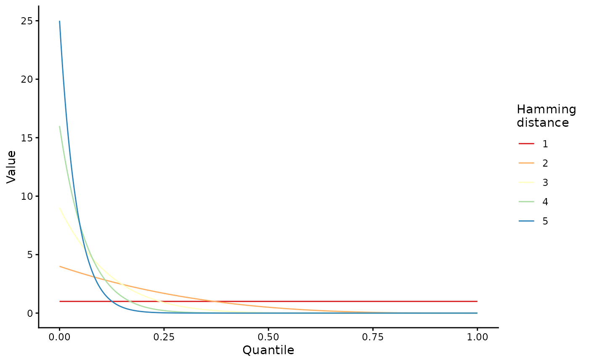

# Simulate within-host evolution with wavess

wavess is an individual-based discrete-time within-host evolution
simulator. We assume that all virus life cycles within the infection are
synchronized into generations. Each generation is one full virus life
cycle, from infecting a cell to exiting the cell.

In this vignette, we focus on how to simulate within-host evolution
using the
[`run_wavess()`](https://molevolepid.github.io/wavess/reference/run_wavess.md)
function. We will be using the HIV ENV gp120 gene as an example. Please
note that the default arguments were set with this particular organism
and genomic region in mind. If you’d like to simulate something else,
you may have to modify certain parameters. However, if you are
interested in this gene in particular, you can probably use most of the
defaults including the founder and reference sequences provided as
examples.

## A note about using the simulation output

Before we get started, I just want to note that the output of these
simulations is stochastic, meaning they will be different each time it
is run. You can set a seed for reproducibility and troubleshooting if
you’d like, but for the vast majority of applications, you will want to
run many replicates of a given simulation scenario with different seeds
(random is okay) to get a reasonable sense of what dynamics are
observed. You will also want to check the simulation outputs to see if
they are giving you reasonable/expected results that conform to your
prior knowledge about the system you’re simulating. If the output does
not seem right, you might have to tweak the input parameters to work for
your particular system. We go into more detail about analyzing the model
output in a separate vignette (see
[`vignette("analyze_output")`](https://molevolepid.github.io/wavess/articles/analyze_output.md)).

## Load libraries

First, we have to load the wavess library and a few additional libraries
that we’ll use for this vignette:

``` r
library(wavess)
library(ape)
library(dplyr)
#> 
#> Attaching package: 'dplyr'
#> The following object is masked from 'package:ape':
#> 
#>     where
#> The following objects are masked from 'package:stats':
#> 
#>     filter, lag
#> The following objects are masked from 'package:base':
#> 
#>     intersect, setdiff, setequal, union
library(ggplot2)
```

## Create Python virtual environment

Next, we must create a Python virtual environment. The virtual
environment is required because the underlying code of
[`run_wavess()`](https://molevolepid.github.io/wavess/reference/run_wavess.md)
is written in Python. You only have to create the virtual environment
once on each machine.

``` r
create_python_venv()
#> Warning in create_python_venv(): Skipped installation of the following
#> packages: numpyscipypandas Use `force` to force installation or update.
```

## Prepare input data

Next, we must generate the input data. If you’re interested in learning
more about how to prepare the input data, please see the corresponding
vignette (see
[`vignette("prepare_input_data")`](https://molevolepid.github.io/wavess/articles/prepare_input_data.md)).

We will only simulate 300 generations with sampling every 100
generations so the simulation doesn’t take too long to run.

``` r
pop <- define_growth_curve(n_gens = 300)
samp <- define_sampling_scheme(sampling_frequency_active = 100, sampling_frequency_latent = 100) |> filter(day <= 300)
founder_ref <- extract_seqs(hxb2_cons_founder,
  founder = "B.US.2011.DEMB11US006.KC473833",
  ref = "CON_B(1295)",
  start = 6225, end = 7787
)
gp120 <- slice_aln(hxb2_cons_founder, 6225, 7787)
epi_probs <- get_epitope_frequencies(env_features$Position)
ref_founder_map <- map_ref_founder(gp120,
  ref = "B.FR.83.HXB2_LAI_IIIB_BRU.K03455",
  founder = "B.US.2011.DEMB11US006.KC473833"
)
epitope_locations <- sample_epitopes(epi_probs,
  ref_founder_map = ref_founder_map
)
#> 16 resamples required
```

## Simplest way to `run_wavess()`

The simplest way to simulate within-host evolution is to use all of the
defaults, and only input the population growth and sampling scheme,
founder sequence, and nucleotide substitution probabilities.

Please note that the total population size simulated greatly influences
the simulation output.

``` r
required_args_only <- run_wavess(
  inf_pop_size = pop,
  samp_scheme = samp,
  founder_seqs = rep(founder_ref$founder, 10)
)
```

Here, we simulate one founder sequence. You may simulate more, but you
will have to ensure that they are the same length, do not include gaps,
and are codon-aligned. You will also have to modify the input growth
curve to start with the correct number of cells. See
[`vignette('prepare_input_data')`](https://molevolepid.github.io/wavess/articles/prepare_input_data.md)
for more details.

The output format of
[`run_wavess()`](https://molevolepid.github.io/wavess/reference/run_wavess.md)
is a list of length four containing a tibble of various counts, the
fitness of the sampled viruses, and the DNA sequences of the sampled
viruses from the active and latent reservoir:

``` r
names(required_args_only)
#> [1] "counts"      "fitness"     "seqs_active" "seqs_latent"
```

Note that, if no latent cells are sampled, then the length of the list
will be three instead, with no sequences from latent cells.

The counts tibble contains the following columns:

- `generation`: generation that number of events was recorded and
  sequences were sampled
- `active_cell_count`: active cell count
- `latent_cell_count`: latent cell count
- `active_turned_latent`: number of active cells that became latent
- `latent_turned_active`: number of latent cells that became active
- `latent_died`: number of latent cells that died
- `latent_proliferated`: number of latent cells that proliferated
- `number_mutations`: number of mutations across all sequences
- `number_recombinations`: number of infected cells with at least one
  recombination event
- `mean_fitness_active`: mean fitness of active cells
- `mean_conserved_active`: mean conserved sites fitness of active cells
- `mean_b_immune_active`: mean antibody immune fitness of active cells
- `mean_t_immune_active`: mean cytotoxic T-lymphocyte (CTL) immune
  fitness of active cells
- `mean_replicative_active`: mean replicative fitness (comparison to
  `ref_seq`) of active cells

``` r
required_args_only$counts
#> # A tibble: 4 × 15
#>   generation active_cell_count latent_cell_count active_turned_latent
#>        <int>             <int>             <int>                <int>
#> 1          0                10                 0                    0
#> 2        100              2000               119                    4
#> 3        200              2000               175                    2
#> 4        300              2000               173                    0
#> # ℹ 11 more variables: latent_turned_active <int>, latent_died <int>,
#> #   latent_proliferated <int>, number_mutations <int>,
#> #   number_recombinations <int>, mean_fitness_active <dbl>,
#> #   mean_conserved_active <dbl>, mean_b_immune_active <dbl>,
#> #   mean_t_immune_active <dbl>, mean_replicative_active <dbl>,
#> #   mean_immune_active <dbl>
```

As you can see, the default values for
[`run_wavess()`](https://molevolepid.github.io/wavess/reference/run_wavess.md)
include latency, mutations, and dual infections (which lead to
recombination), but no fitness costs.

The fitness tibble contains a row for each sampled sequence (all from
the active pool) and the following columns:

- `generation`: generation that the virus was sampled in
- `seq_id`: sequence id (corresponds to the sequence name below). Note
  that the same value for different generations *does not* say anything
  about the ancestral relationship between the viruses.
- `immune`: virus immune fitness
- `conserved`: virus conserved fitness
- `replicative`: virus replicative fitness (compared to a reference)
- `overall`: overall fitness (the other three multiplied together)

``` r
required_args_only$fitness
#> # A tibble: 80 × 8
#>    generation seq_id   b_immune t_immune conserved replicative overall immune
#>    <chr>      <chr>       <dbl>    <dbl>     <dbl>       <dbl>   <dbl>  <dbl>
#>  1 founder    founder0        1        1         1           1       1      1
#>  2 founder    founder1        1        1         1           1       1      1
#>  3 founder    founder2        1        1         1           1       1      1
#>  4 founder    founder3        1        1         1           1       1      1
#>  5 founder    founder4        1        1         1           1       1      1
#>  6 founder    founder5        1        1         1           1       1      1
#>  7 founder    founder6        1        1         1           1       1      1
#>  8 founder    founder7        1        1         1           1       1      1
#>  9 founder    founder8        1        1         1           1       1      1
#> 10 founder    founder9        1        1         1           1       1      1
#> # ℹ 70 more rows
```

Again, the fitness is 1 for everything here because we didn’t model
fitness.

The sequences are returned as well, in
[`ape::DNAbin`](https://rdrr.io/pkg/ape/man/DNAbin.html) format:

Sequences from active cells:

``` r
required_args_only$seqs_active
#> 80 DNA sequences in binary format stored in a matrix.
#> 
#> All sequences of same length: 1503 
#> 
#> Labels:
#> founder0
#> founder1
#> founder2
#> founder3
#> founder4
#> founder5
#> ...
#> 
#> Base composition:
#>     a     c     g     t 
#> 0.370 0.165 0.222 0.243 
#> (Total: 120.24 kb)
```

Sequences from latent cells:

``` r
required_args_only$seqs_latent
#> 60 DNA sequences in binary format stored in a matrix.
#> 
#> All sequences of same length: 1503 
#> 
#> Labels:
#> gen100_latent_0
#> gen100_latent_1
#> gen100_latent_2
#> gen100_latent_3
#> gen100_latent_4
#> gen100_latent_5
#> ...
#> 
#> Base composition:
#>     a     c     g     t 
#> 0.370 0.165 0.222 0.243 
#> (Total: 90.18 kb)
```

Each sequence is named as follows:

- Founder sequences are named as “founderX” where X is the index of the
  founder sequence in the input vector (indexed at 0).
- All other sequences are sampled and are named by the generation,
  whether they were sampled from the active or latent reservoir, and a
  number. Note again that the same value for different generations *does
  not* say anything about the ancestral relationship between the
  viruses.

These outputs can be plotted and analyzed in various ways. If you’d like
to learn more about how to analyze the output, please check out the
post-processing vignette
[`vignette("analyze_output")`](https://molevolepid.github.io/wavess/articles/analyze_output.md).

## Including selective pressures

[`run_wavess()`](https://molevolepid.github.io/wavess/reference/run_wavess.md)
can simulate four types of selective pressure:

- Conserved sites fitness
- Replicative fitness relative to a “most fit” reference sequence
- B-cell (antibody) immune response
- T-cell (CTL) immune response

Note that all nucleotide positions related to fitness are expected to be
indexed at 0. Including these requires additional inputs, which are
described in more detail in the prepare input data vignette
([`vignette("prepare_input_data")`](https://molevolepid.github.io/wavess/articles/prepare_input_data.md)).

Both conserved sites fitness and replicative fitness (comparison to a
reference) are modeled using a multiplicative fitness landscape with the
equation:

    fitness = (1 - cost) ** n_mut

The fitness cost must be between 0 and 1, where 0 indicates no fitness
cost and 1 indicates no ability to survive. `n_mut` is the number of
mutations in conserved sites or the number of nucleotides different from
the reference sequence.

For additional details on how each of these selective pressures is
implemented, please see the
[paper](https://journals.plos.org/ploscompbiol/article?id=10.1371/journal.pcbi.1013437).

### Conserved sites fitness

To simulate conserved sites fitness, you must provide a vector of sites
in the founder sequence that are considered to be conserved
(`conserved_sites` argument). By default, the cost of a mutation at
these sites is 0.99 (`conserved_cost` argument).

Here’s an example of simulating evolution with conserved sites fitness:

``` r
conserved_fitness <- run_wavess(
  inf_pop_size = pop,
  samp_scheme = samp,
  founder_seqs = rep(founder_ref$founder, 10),
  conserved_sites = founder_conserved_sites,
  conserved_cost = 0.99
)
```

If you look at the mean conserved fitness of active cells, you’ll see
that it’s not always 1 (although it may sometimes be 1 depending on the
simulation, since the output is stochastic).

``` r
conserved_fitness$counts$mean_conserved_active
#> [1] 1 1 1 1
```

### Replicative fitness

To simulate replicative fitness, you must provide a “most fit” reference
sequence to compare each simulated sequence to. The strength of this
fitness can be altered using the `replicative_cost` argument.

``` r
ref_fitness <- run_wavess(
  inf_pop_size = pop,
  samp_scheme = samp,
  founder_seqs = rep(founder_ref$founder, 10),
  ref_seq = founder_ref$ref
)
```

Here, you can see that the mean replicative fitness is now less than 1:

``` r
ref_fitness$counts$mean_replicative_active
#> [1] 0.8520756 0.8491750 0.8467552 0.8450571
```

### Immune fitness

Active immunity can be modeled by defining epitope locations that can be
recognized by the immune system. There are two components:

- **B-cell immunity**, controlled by the `b_epitope_locations`,
  `b_immune_start_day`, `b_n_for_imm`, and `b_days_full_potency`
  arguments.
- **T-cell immunity**, controlled by the `t_epitope_locations` and
  `t_max_immune_cost` arguments.

### B-cell immune fitness

For B-cell immunity, epitope locations are specified in
`epitope_locations` and all epitopes must currently be the same length.
Nucleotide epitopes are translated into amino acids before B-cell immune
fitness costs are calculated. An epitope is recognized only when it is
present at least 100 times across the population (`b_n_for_imm`
argument). Once an epitope is recognized, it undergoes affinity
maturation for 90 days (`b_days_full_potency`), at which time it reaches
its maximum cost. Epitopes are also cross-reactive.

Cross-reactivity is sampled from a Beta distribution where alpha is 1
and beta is the square of the amino acid edit distance to the nearest
recognized epitope:

``` r
lapply(1:5, function(x) {
  tibble(
    n_muts = factor(x),
    quantile = seq(0, 1, 1 / 1000),
    val = dbeta(quantile, 1, x^2)
  )
}) |>
  bind_rows() |>
  ggplot(aes(x = quantile, y = val, col = n_muts)) +
  geom_line() +
  scale_color_brewer(palette = "Spectral") +
  theme_classic() +
  labs(x = "Quantile", y = "Value", col = "Hamming\ndistance")
```



``` r
immune_fitness <- run_wavess(
  inf_pop_size = pop,
  samp_scheme = samp,
  founder_seqs = rep(founder_ref$founder, 10),
  b_epitope_locations = epitope_locations
)
```

The B-cell immune fitness here is now less than 1 after the immune
system kicks in:

``` r
immune_fitness$counts$mean_b_immune_active
#> [1] 1.0000000 0.7011400 0.7269373 0.7314997
```

Please note that the model is very sensitive to the maximum antibody
immune fitness cost for a given epitope.

### T-cell immune fitness

If you specify `t_epitope_locations`, T-cell immunity will also be
modeled and the output will additionally include T-cell immune fitness
summaries in the `mean_t_immune_active` column of the `counts` tibble
and the `t_immune` column of the `fitness` tibble.

When modeling the CTL response, we recommend making the conserved cost
and the maximum T-cell immune cost the same as it is unclear that one
selective pressure always dominates over the other. Below we use 0.5 for
both.

Here is a minimal example using a toy T-cell epitope tibble (matching
the structure built in
[`vignette("prepare_input_data")`](https://molevolepid.github.io/wavess/articles/prepare_input_data.md)):

``` r
t_epitope_locations <- data.frame(
  start = c(303, 303, 345, 345, 828, 828),
  days_to_full_potency = c(4, 4, 11, 11, 4, 4),
  escape_position = c(2, 9, 2, 9, 2, 9),
  recognized_aa = c("M", "L", "P", "L", "A", "L")
)

tcell_fitness <- run_wavess(
  inf_pop_size = pop,
  samp_scheme = samp %>% mutate(day = c(0, 1, 2, 3)),
  founder_seqs = rep(founder_ref$founder, 10),
  t_epitope_locations = t_epitope_locations,
  t_max_immune_cost = 0.5,
  conserved_cost = 0.5
)

tcell_fitness$counts$mean_t_immune_active
#> [1] 1.0000000 0.7308239 0.5113636 0.3373580
```

## Multiple selective pressures at once

You can also include multiple selective pressures at once by using
multiple of the arguments described above.

## Events defined by rates

There are several events that can occur during within-host evolution
that are defined by rates of occurrence (which are converted into
per-generation probabilities). These include the mutation rate
(`mut_rate`), the recombination rate (`recomb_rate`), and various rates
related to latent cell dynamics (`act_to_lat`, `lat_to_act`,
`lat_prolif`, `lat_die`). Each of these can be turned off by setting the
respective rate value to 0. The simulation starts with 0 latent cells,
so setting `act_to_lat` will turn latent cell dynamics off.

### Variable recombination rate

The recombination rate modeled by wavess is an effective recombination
rate - one number that takes into account the rate of co-infection
followed by recombination. By default, the recombination rate is the
same across the entire sequence. This occurs whenever the input value is
a single number. If you’d like to vary the recombination rate across the
sequence, you can input a vector of rates where each element in the
vector is a breakpoint-specific recombination rate. In this case, the
length of the vector should be one fewer than the number of basepairs in
the founder sequence. Here’s an example:

``` r
variable_recomb <- run_wavess(
  inf_pop_size = pop,
  samp_scheme = samp,
  founder_seqs = rep(founder_ref$founder, 10),
  recomb_rate = c(rep(1.5e-5, 1000), 1e-4, rep(1.5e-5, 501))
)
```

Note that inputting a vector for `recomb_rate` also allows you to
simulate reassortment of a segmented virus. In this case, the
“recombination rate” between two segments is the rate of co-infection
followed by rassortment, and the rate within a segment is the rate of
co-infection followed by recombination within that segment.

Alternatively, if you want to model two genes separated by n bases that
are not modeled (i.e. not included in the founder sequence), then the
recombination rate between the two genes is base_rate\*(n+1).
[Here](https://github.com/MolEvolEpid/wavess_ctl_manuscript/blob/main/wavess_modeling/scripts/prep_inputs.R)
is example code that preps an input founder sequence where pol and gp120
are spliced together with a higher recombination rate between the genes.

## Seed

A seed can be set for reproducibility using the `seed` argument.

## Next: analyzing the outputs

Next, check out
[`vignette("analyze_output")`](https://molevolepid.github.io/wavess/articles/analyze_output.md)
for various ways to visualize and analyze the output data.
